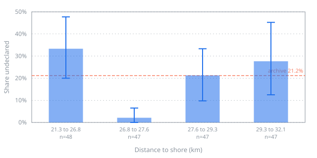
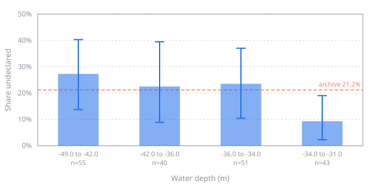
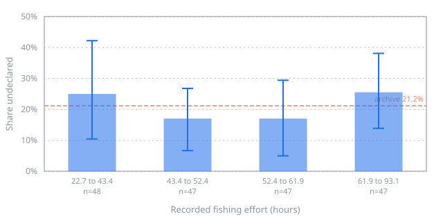

# Changelog

The run-by-run record of this project: what was tried, what the numbers were, and what did not
work. Entries are in the order they happened, oldest first. The project overview, the setup and
the way to run the chain are in [README.md](README.md).

## Training the detector

How training is set up, and why it runs on Kaggle rather than here, is in
[README.md](README.md#training-the-detector). What follows is the record of the runs.

### The first run — 2026-08-14

12 epochs on a Kaggle T4, about 13 minutes each. The run was interrupted after the first epoch and
the next session continued at the second, which is what the whole design is for. Numbers below are
from the saved `metrics.json` of the final epoch, scored over the **entire** held-out split —
scenes 11 to 15, 3000 sub-images, 2378 ships, empty tiles included.

| Score threshold | Precision | Recall | Found | False | Missed |
| --- | --- | --- | --- | --- | --- |
| 0.25 | 0.578 | 0.867 | 2062 | 1507 | 316 |
| 0.50 | 0.808 | 0.789 | 1877 | 445 | 501 |
| **0.75** | **0.941** | **0.706** | 1680 | 106 | 698 |
| 0.90 | 0.986 | 0.535 | 1272 | 18 | 1106 |

It trained on 2246 of the 6000 sub-images cut from scenes 1 to 10: every one of the 1123 carrying
a ship, plus 1123 of open water. Those 1123 tiles hold 3637 ships and the held-out split 2378 —
6015 between them, which is the total LS-SSDD publishes, so nothing was dropped on the way in.

Two things about this run are worth more than the table.

**It did not converge, it oscillated.** The training loss fell from 0.181 to 0.136 and then sat
there, while precision at a fixed threshold of 0.50 went 0.55, 0.74, 0.75, 0.41, 0.64, 0.84, 0.65,
0.28, 0.80, 0.63, 0.53, 0.81 across the twelve epochs. Adjacent epochs differ by a factor of
three. The learning rate is constant with no decay, so the model reaches the neighbourhood of a
minimum in three epochs and bounces around it for nine more; what moves is the calibration of its
scores rather than the quality of its detections. The loss curve says nothing about any of this —
it is the held-out split, scored every epoch, that shows it. Epoch 9 was better than epoch 12
(F1 0.817 against 0.807) and `keep: 2` had already deleted it.

**The same config ran twice and produced two different detectors.** Kaggle's *Save Version*
re-executes the whole notebook in a fresh machine, so the console log and the saved artefact came
from two complete runs — and they disagreed on every epoch, because the seed named the data and
not the model. The detection head is built fresh and drew from an unseeded generator. Fixed, and
both findings are written up in [`docs/failures.md`](docs/failures.md).

The labels are **LS-SSDD-v1.0**: 15 large Sentinel-1 IW acquisitions, VV, cut by its authors into
9000 sub-images of 800 x 800, ships labelled by SAR experts against AIS and Google Earth. It is
chosen because its physics is this chain's physics — same satellite, same 10 m pixel, the same
problem of a hull three pixels across against an enormous empty sea. The higher-resolution sets
were rejected for the opposite reason: at 0.5 m a ship is a hundred pixels with a superstructure,
and those are not the features available here.

Four decisions in it are worth stating, because each one is a way to report a number that is not
true:

- **The split is drawn by scene, never by sub-image.** Two 800 px cuts of one acquisition share a
  sea state, an incidence angle and a speckle distribution, and a ship on the seam is in both.
  LS-SSDD's own split — scenes 01–10 against 11–15 — is used as published, so the numbers are
  comparable to the baselines rather than only to themselves.
- **Only the training side is cut down.** Every tile carrying a ship is kept, plus one empty tile
  per ship-bearing tile, because free-tier hours are the binding constraint. The held-out split is
  scored entire: the empty tiles are exactly where a false positive happens, and dropping them
  would report a precision the detector had not earned.
- **Augmentations move pixels and never change them.** Flips and quarter turns, the eight
  symmetries of the square. Amplitude on radar *is* the measurement, so a contrast jitter does not
  produce a second look at the same ship — it produces a ship made of a different material. The
  test for this asserts the property rather than the list: the sorted pixel values of a tile come
  back identical after any augmentation the code is allowed to apply.
- **A detection is scored against the tolerance the fusion will apply to it** — 200 m, in metres,
  read into pixels through the resolution — rather than by box overlap. At 10 m a 60 m vessel is
  six pixels, so an IoU score here mostly measures a box no part of this chain uses. It is also
  the generous reading, and it is in the config in the open for that reason.
- **Where the annotations start counting is measured, not assumed.** VOC boxes are inclusive
  pixel indices and the file does not say whether they count from zero or from one; the two
  readings differ by a pixel, which on a four-pixel ship is a quarter of the target, in the same
  direction for every ship, visible nowhere. An index of 0 cannot occur in a set counting from
  one and an index equal to the width cannot occur in one counting from zero, so the boxes settle
  it themselves. Where they cannot — a subset too small to contain either — the load refuses
  rather than defaulting.

The architecture is a stock Faster R-CNN with a two-class head, and its anchors are torchvision's
own. The smallest is 32 px, a 320 m vessel at 10 m, longer than nearly everything in the training
set — so the expectation written here before the first run was that recall would be poor. It was
not: 0.71 at a precision of 0.94. An anchor is where the region proposal network starts regressing
from, not a filter on what it can return, and on the high-resolution level of the pyramid a 32 px
anchor reaches hulls of a few pixels perfectly well. The prediction was wrong and the reasoning
behind it was too strong; the decision to ship the stock sizes stands, because the ticket that
adapts them has to measure each change against the configuration before it, and this is that
configuration. `anchor_sizes` is a config key.

The run is built for being interrupted rather than for finishing. Checkpoints are written every
epoch, under a temporary name and moved into place in one step, so a kernel stopped halfway
through writing 300 MB leaves the last good epoch standing instead of a truncated file that the
next session resumes from. Weights are written *before* the held-out split is scored: an
interrupted evaluation costs numbers that can be recomputed, an interrupted checkpoint costs an
epoch that cannot. And a resumed session is the same run, not a similar one — which empty tiles
the subset kept, which way each tile is laid down and the order they arrive in are all derived
from one seed and the epoch number rather than from a generator's position in a stream.

That claim is checked rather than asserted. `tests/test_training_run.py` runs the real loop and
the real model builder on the CPU over eight tiles, kills the session after one epoch, and
requires a second session with freshly initialised weights to continue at epoch 2. It is skipped
where torch is not installed, which includes CI — the chain's acceptance condition is that it
installs and runs without a framework, and the suite is honest about running without one.

Everything that can be got wrong quietly is on the torch-free side of that seam and is tested in
CI: the split, the subset, the augmentations, the counting, and the resume bookkeeping. Only the
architecture and the loop itself need the framework.

```bash
pip install -e ".[detector]"
darkvessel train --config configs/train.yaml   # locally: proves it starts, then use Kaggle
```

The reasoning behind each of these is in [`docs/decisions.md`](docs/decisions.md).

### The ladder — 2026-08-23

Issue #11 asks for three adaptations for small targets and extreme imbalance. Measuring them is
the hard part, and the first run is why: at a learning rate that never decayed, precision at a
fixed threshold went 0.55, 0.74, 0.75, 0.41 … 0.28, 0.80 across twelve epochs. Adjacent epochs
differed by more than any of the three changes was likely to be worth, so comparing one final
number against another would have described the draw rather than the change — with three decimal
places, which is worse than describing nothing.

So the rule was written and committed on 2026-08-17, before any of these runs existed: **a change
is kept only if it beats the previous kept configuration by more than the noise that configuration
was already showing.** The noise is measured, not assumed — the spread of the statistic over a
run's last four epochs. A threshold chosen after seeing the numbers is a narration of them.

Six runs of twelve epochs, one line different each, every one scored over the same held-out
scenes 11 to 15 — 3000 sub-images, 2378 ships. Five were fixed on 2026-08-17 before any of them
ran; the sixth was added on 2026-08-30 to test the hypothesis the other five left standing, and the
table says so at its row. `darkvessel compare --config configs/ladder.yaml` reads the six journals
in [`docs/runs/`](docs/runs/) and prints:

| Rung | What changed | Best F1 | Against | Band | Gain | |
| --- | --- | --- | --- | --- | --- | --- |
| R0 | nothing — the baseline, re-run under the corrected seeding | 0.807 | — | — | — | kept |
| R1 | cosine decay of the learning rate | 0.836 | R0 | 0.026 | +0.028 | kept |
| R2 | `anchor_sizes` to `[[4], [8], [16], [32], [64]]` | 0.788 | R1 | 0.010 | −0.048 | rejected |
| R3 | single-channel stem | 0.836 | R1 | 0.010 | −0.000 | rejected |
| R4 | `rpn_batch_size_per_image` 256 → 32 | 0.827 | R1 | 0.010 | −0.009 | rejected |
| R5 | `rpn_fg_iou_thresh` 0.7 → 0.3 | 0.823 | R1 | 0.010 | −0.013 | rejected |

**One change of six was kept, and it is the one that is not among the ticket's three
adaptations.** Cosine decay bought +0.028 and, more usefully, cut the noise band from 0.026 to
0.010 — the baseline reached the neighbourhood of its optimum by epoch 3 and bounced there for
nine more, and R1 climbs instead: 0.828, 0.826, 0.833, 0.836 over its last four.

The three adaptations gave, in order, a clear harm, a draw to five decimal places, and a draw
inside the noise. Each has its numbers and its mechanism in
[`docs/failures.md`](docs/failures.md):

- **R2, the small anchors.** The realised positive-anchor fraction falls from 16.8% to 1.4%, so
  the RPN's sampler fills a batch of 256 with about 3.6 positives instead of about 43 and the head
  has an order of magnitude fewer examples from which to learn confidence. The anchor census
  predicted this in writing on 2026-08-19, before any rung ran.
- **R3, the single-channel stem.** 0.83556 against R1's 0.83557. The folded stem agrees with the
  three-copy repeat inside the tile at initialisation and differs only over a three-pixel border,
  so a near-null was expected; it arrived nearer to null than anyone would have bet. The three
  copies were not costing anything, and that is a measured answer rather than an assumed one.
- **R4, the RPN sampler.** −0.0087 against a band of 0.0099 — the change is smaller than the noise
  it had to beat, which makes it a draw rather than a harm. What it demonstrably did do is widen
  the band to 0.019, the noisiest run on the kept branch: sixteen positives and sixteen negatives
  per image is a noisier gradient than 43-odd positives out of 256.
- **R5, the foreground IoU threshold.** −0.0128 against the same 0.0099 — outside the band, so a
  loss rather than a draw, though a small one against its own band of 0.025. Added after the five
  above had run, which is the thing the rule exists to make suspect; what makes it admissible is
  that its hypothesis was written down on 2026-08-19, three days before the first rung trained, and
  its value came from a measurement rather than from the five outcomes.

Training losses are not comparable across rungs that move the anchors or the sampler, and both
directions of that trap appear here: R2's final loss is 0.044 against R1's 0.117 on a detector
that is measurably worse, and R4's first epoch is the highest of the five because a balanced
sample is a harder one.

**What the kept configuration does.** R1 at epoch 12, over the entire held-out split:

| Score threshold | Precision | Recall | Found | False | Missed |
| --- | --- | --- | --- | --- | --- |
| 0.25 | 0.529 | 0.928 | 2206 | 1964 | 172 |
| 0.50 | 0.710 | 0.886 | 2107 | 859 | 271 |
| **0.75** | **0.848** | **0.824** | 1959 | 352 | 419 |
| 0.90 | 0.950 | 0.713 | 1695 | 90 | 683 |

Against the 2026-08-14 baseline at the same threshold — precision 0.941, recall 0.706 — the
schedule trades precision for a good deal more recall: 279 more ships found, 246 more false
detections. F1 0.836 against 0.807.

**What was left standing, and what happened to it.** Almost no ship reaches an IoU of 0.7 against
any anchor, in either anchor set — which pointed at the RPN's foreground IoU threshold rather than
at anchor geometry or sampler batch size. Two rungs had failed in the region that hypothesis
describes and neither had tested it, because the five rungs were fixed before the census that
produced it. [Issue #24](https://github.com/esamoun/dark-vessel-detection/issues/24) is the rung
that did, and **the hypothesis does not hold.**

Dropping the threshold to 0.3 gives 1019 more ships a genuine match and roughly doubles the
positives the RPN samples, from 43 per image to 96 — and the detector gets *worse*, by 0.0128. Not
where it was predicted to, either: precision is unchanged at 0.850, and the whole loss is recall.
At the most permissive threshold reported, R5 finds 2203 of the 2378 held-out ships where R1 finds
2275, so 72 ships leave its reach altogether rather than falling below an operating point.

The mechanism inverts the census's own reading. Under 0.7, a ship's positive anchors are the ones
tied at *its own maximum* overlap, which are by construction the anchors centred on it; the rescue
rule forces that whole tied set positive. An IoU floor of 0.3 admits anchors sitting off to one
side as well, and the RPN learns a blunter answer. `allow_low_quality_matches` was not a pathology
being worked around — it was selecting a better positive set than a threshold does, because a tied
maximum is a centring criterion and a floor is not. Written up with its numbers in
[`docs/failures.md`](docs/failures.md).

The value came from a measurement rather than from the five results above it: a threshold sweep
added to `notebooks/anchor_census.py`, run on 2026-08-30, costing no GPU time. Over the same 3637
ships the median one's best overlap with any anchor is **0.207** — below the `256/1024 = 0.25` this
repository had been quoting, which squares a length where the overlap is an area, but twice the
0.10 the prediction beside it named. 0.3 rather than lower because `Matcher` refuses a background
threshold above the foreground one, so 0.3 is the last value one line can reach, and one line is
this ladder's rule.

Both predictions this rung committed before its measurements went half right, and both are recorded
as they landed. See [`docs/decisions.md`](docs/decisions.md), 2026-08-29 and 2026-08-30, and
[`docs/failures.md`](docs/failures.md) for the verdict.

```bash
darkvessel compare --config configs/ladder.yaml
darkvessel evaluate --metrics docs/runs/r1-cosine-rerun.json --svg docs/figures/precision-recall-r1.svg
```

The second of those draws the kept rung's whole precision-recall curve, with the range each point
covered over the last four epochs.
[`docs/evaluation.md`](docs/evaluation.md) reads it: where the chain sits on that curve and what
it pays, what the 651 missed ships are actually made of — 542 of them are found by the detector
and discarded by the threshold — the failure modes by cause, and the ten conditions none of this
has ever been tested under. It reads the **second** execution of R1, which is the one the chain
loads; the table above is the first, which is the one the ladder judged. Why there are two, and
what they agree on, is in [`docs/decisions.md`](docs/decisions.md) under 2026-08-26.

## Swapping it into the chain — 2026-08-16

The trained model now satisfies the same `detector` parameter the threshold stand-in satisfies,
and no other stage changed. That is what the seam was built for, and this is where it paid.

> **Which weights, and which numbers.** The tables in this section were produced by the detector of
> 2026-08-14 at a score threshold of 0.75. The chain now loads R1's weights — the one rung of
> [the ladder](#the-ladder--2026-08-23) that was kept — at a threshold of 0.90, where R1 gives the
> precision this swap was decided on.
>
> Those weights have been run over this frame since 2026-08-26, and they return the same six
> vessels by MMSI with every score higher: 0.850 → 0.976 on the 274 m hull, 0.862 → 0.927 on the
> 24 m one. At 0.90 the older detector would have returned **four** of the six, dropping the
> largest vessel in the frame and the smallest. What has not been repeated under them is the rest
> of the analysis below — the count of objects checked by eye, the sidelobe stack, the decibel
> sweep — all of which belongs to the older detector.
>
> They are also not the weights the ladder judged: that session was lost before its checkpoint was
> ever saved, so R1 was executed a second time from the same config and the same seed.
> `docs/decisions.md`, 2026-08-26, measures what the two executions agree on — including that the
> ladder returns the same verdict on all five rungs under either.

```bash
darkvessel run --config configs/kattegat-lane.yaml
```

Nine seconds on an 8 GB M1 laptop: nine tiles of 800 px, no GPU.

### What it found, against the baseline

Six vessels declared themselves inside this scene at the instant it was acquired. Both detectors
are scored below against where those six actually appear **in the radar image**, which is not
always where they declared themselves — see the caveat under it.

| | Detections | Hulls found | Detections on no hull |
| --- | --- | --- | --- |
| Threshold at 0 dB | 16 | 6 / 6 | 2 |
| **Trained, score 0.75** | **6** | **6 / 6** | **0** |

The baseline was not blind — it found all six. It reported them sixteen times: the stack of nine
detections inside one 200 m square in the north-west was a single bright hull counted nine times,
because a threshold has no notion of what a vessel is and reports every connected bright region
it meets. The trained model reports each hull once and adds nothing.

### Why the radar's positions are not the declared ones

Scoring against radar positions rather than declared ones is not a convenience. Four of the six
vessels are imaged **420 to 490 m from where AIS puts them**, almost purely north–south, because
Sentinel-1 displaces moving targets along its own track: a vessel closing on the radar adds
Doppler of its own, and nothing in the processing can tell that apart from Doppler caused by
position. The two the chain originally matched are exactly the two whose displacement stayed
inside the 200 m tolerance, and the one vessel with no east–west velocity is displaced by nothing
at all. The measurement, including that control, is in [`docs/failures.md`](docs/failures.md).

### Correcting it — matched vessels, 2 → 5

The declaration is now moved to where the radar would have drawn the vessel, before matching,
using the velocity the AIS track already carries. The tolerance stays at 200 m — widening it
instead would buy the four accusations back by making every match looser, and a genuinely dark
vessel passing near a declared one would be quietly explained away.

| | Matched | Dark |
| --- | --- | --- |
| No correction | 2 | 4 |
| Corrected | **5** | 1 |

The direction comes off the product's `ORBIT_PASS` tag. The magnitude needs the incidence angle,
which the product does not carry, so `fusion.azimuth.incidence_deg` declares it — 38.5°, the
middle of an IW swath, and an approximation stated in the open.

The sixth vessel is not recovered, and it is not recoverable by tuning: 34° gives four matches,
38.5° and 43° give five, 46° over-corrects back to four. The residual is in the bearing or in
where a detection's centroid falls, and six vessels found with a pixel-resolution peak finder
cannot separate those. Picking the incidence angle that made the sixth match would be fitting the
geometry to the answer, which is the one thing this correction must not do.

### The window between decibels and amplitude

The gap recorded on 2026-08-14 is closed. The chain exports calibrated decibels, the model was
fitted on 8-bit amplitude over 255, and the stretch between them is not recoverable from the
dataset — so it was chosen, and half of it was chosen by measurement.

LS-SSDD's sea sits at **0.2000**, measured over 2,234 offshore held-out tiles outside the
annotated boxes. Putting this scene's sea (−21.84 dB) there fixes one end of the window. The
other end could not be measured: matching the *spread* of the two seas would set the width from
how grainy each product is, and LS-SSDD's sea is three times grainier than this GRD — a
difference in multi-looking, not in stretch. So the width was swept from 25 to 60 dB against the
declared vessels; every width from 25 to 45 recovers all six hulls and 50 upwards starts losing
them. 40 dB is the middle of what works, and the shipped window is −29.84 to +10.16 dB.

That is one free parameter tuned on the scene it is then reported on. It is written down as that.
The numbers that carry weight are still the held-out LS-SSDD table above.

## Describing what it found — 2026-08-26

The chain says where the vessels are. It says nothing about what they are, and it never will:
there are no labels for that, and there is no prospect of any. What there is instead is a lot of
unlabelled detections, and a way of learning from exactly that.

A second, small model is fitted on the crops the detector returns, with no labels anywhere in it.
What supervises it is a statement rather than an annotation: two views of one crop are the same
object, and two views of different crops are not. Which transformations may stand between the two
views is therefore the whole specification, and radar narrows it sharply — colour and contrast
jitter have no physical meaning on a backscatter coefficient, so a view is one of the eight
symmetries of the square, a translation of a few pixels, and **speckle**, which is the one
value-changing augmentation the physics itself provides. A multi-looked intensity image carries a
fluctuation that is Gamma distributed with shape equal to the number of looks, so a second look at
the same sea is that sea times a draw from that distribution. The number of looks is measured on
the archive's own scenes rather than quoted: across fifty acquisitions it runs from 0.01 to 5.14
against a nominal 4.4, and the low end is not more speckle but less sea — a calm morning
backscatters at −37 dB, close enough to the noise floor that its variation in decibels is five
times a windy day's.

### The archive

One acquisition of the shipping lane holds six vessels, which is not an archive. So the level is
built on **two** rectangles, fifty acquisitions each, between 1 June and 9 August 2026, ascending
and descending both: the Kattegat lane the chain runs over, and the Anholt box the study area
moved off in August. Anholt was given up for having no ships in it; what it has instead is a
documented 111-turbine lattice, and an archive drawn from the lane alone can never show a
representation telling a turbine from a ship, whatever the representation does.

Both boxes are cut at a detector score of **0.05** rather than the 0.90 the chain publishes at.
That threshold was chosen for precision because every dark vessel the chain reports is a claim
someone may be sent out on; nothing here is published, and a representation fitted only on the
objects the detector was already certain about has never been shown the ones it was not. It comes
to **4,676 crops of 64 px from 96 acquisitions** — 348 from the lane and 4,328 from Anholt, which
is the imbalance you would expect from 111 fixed scatterers standing in every frame against five
or six ships passing through. Three Anholt clips held no water at all: Earth Engine's search asks
whether a footprint *intersects* the rectangle, not whether it covers it.

A hundred epochs, sixteen dimensions, a bit over an hour of laptop CPU. The detector needed a
rented GPU and several evenings. Both figures are worth stating.

**The turbines are in there, and that was checked before any method was written to find them.**
`python3 notebooks/recurrence.py` asks nothing of the embedding: it groups detections whose ground
positions fall within 100 m and counts how many acquisitions each standing position appears in. A
ship under way does not come back. A mast does.

| Positions seen in… | kattegat-lane | anholt |
| --- | --- | --- |
| 2+ acquisitions | 21 | 91 |
| 5+ | 2 | **69** |
| 10+ | 1 | **67** |
| 20+ | 0 | **65** |
| most persistent | 11 acquisitions | **46 of 47** |
| crops at a position seen 5+ times | 23 of 348 | **4,232 of 4,328** |

Sixty-five positions stand still across twenty acquisitions or more, one of them across 46 of the
47. The lane behaves as the control should — except for one position seen in 11 acquisitions, in
the box that is supposed to have no fixed structures in it. That is not a ship either, and it is
written down here rather than tidied away.

*(The last row of that table read `2,612 of 4,328` until 2026-08-27: the notebook summed
acquisition counts under a label that said crops. See [`docs/failures.md`](docs/failures.md).
The figure understated its own argument — 98% of the Anholt archive stands at a persistent
position, not 60%.)*

Those 65 positions are checked against the farm's published coordinates in the next section, and
they turn out to be 64 turbines and a transformer platform.

### What retrieval returns


Each row is one query and its four nearest neighbours in the representation, drawn through the
same decibel window so that two cells side by side are two crops in one unit. The six queries are
spread over the archive's range of apparent target size rather than picked by hand — choosing six
by hand is exactly where a flattering figure would come from.

The rows are coherent, and the top one is the most interesting. Those are detections standing on
the boundary of a hole in the product, and their neighbours are other detections on other holes in
other acquisitions. Nothing labelled them, nothing was told they exist, and they sit together —
which is the claim this level was built to support, made on the least glamorous class it could
have been made on.

### What the check says

| | measured | at chance |
| --- | --- | --- |
| A second view of a crop retrieves its object first | **0.066** | 0.0004 |
| The nearest neighbour is another cut of the query's own object | **71%** | 0.04% |
| The nearest neighbour is a different object in the same acquisition | 11% | — |
| The nearest *different* object differs in apparent size by | **6.0 px** | 16.0 px |

The first needs no labels at all, which is why it is recorded every epoch: a representation that
has collapsed onto a point still returns ranked neighbours with similarities near one for every
query, and scores at chance here. It is also the number that fell hardest when Anholt was added,
from 0.483 to 0.066, and reading that as a worse encoder would be wrong: telling *this* turbine
from its sixty-four identical siblings, through a view shaken by speckle, is a harder question
than the one-box archive ever asked. Put to the identical task — the same 348 lane crops, the same
twins, ranked against those same 348 — the one-box encoder scores 0.489 and this one 0.422. The
rest is the question, not the answer.

The third is a diagnostic rather than a result — the decibel window is fixed across the archive
and the sea under it runs from -37 dB to -11 dB, so a representation that had learned the weather
would return beautiful neighbours all drawn from one acquisition. It does not.

The fourth is the only one that speaks to resemblance *between* objects, and it is ranked over
everything the query is not for exactly that reason: measured over all neighbours it restates the
duplication below rather than saying anything about similarity. Apparent size is also not an
independent label — it is measured from the same pixels the encoder saw — so what it rules out is
narrower than what it might seem to prove: a representation whose neighbours are no closer in size
than a crop drawn at random has not learned the object.

Both of the first two count a hit on *any* cut of an object, because a detector run at 0.05 cuts a
large hull more than once: two thirds of these crops have another detection within 200 m of them
in their own acquisition, 31 m apart at the median. Under the strict rule the same encoder scores
0.316 rather than 0.483, and the gap is duplication and nothing else. The first version of this
check did not make that distinction and read as a poor result for the wrong reason —
[`docs/failures.md`](docs/failures.md) records how that came apart.

### What is not claimed

The twin recall was still rising when the schedule ended — 0.045 at epoch 61, 0.056 at 81, 0.066
at 100 — so this is a run that stopped, not one that converged. The schedule itself is a corrected
mistake: it was first set to 30 epochs on the reasoning that a thirteenfold larger archive needed
a thirteenth of the epochs to do the same number of gradient steps, which held the wall clock and
cut the training. What 400 epochs bought on the one-box archive was 400 augmented views of every
crop, not 4,000 steps. [`docs/failures.md`](docs/failures.md) has the measurement.

Nothing here says the representation transfers beyond these two rectangles; two study areas do not
support that claim and none is made. Separating wind turbines from vessels, which is what the
representation was ultimately for, is the next section — and the short version is that the
representation turned out not to be the part that does it.

The one-box run is kept rather than overwritten. `docs/runs/embedding-kattegat.json` and
`docs/runs/retrieval-kattegat.json` are the numbers issue #13 was closed on, and
`docs/figures/retrieval-kattegat.svg` is its contact sheet.

The embedding stage is optional and the chain is unchanged by it. `configs/pipeline.yaml` and
`configs/kattegat-lane.yaml` run without an encoder, import no framework, and write exactly the
layer they wrote before this level existed. `configs/embeddings.yaml` is the same run with the
stage on: same six detections, same five matched and one dark, and sixteen more columns per row in
`outputs/kattegat-lane-embedded.gpkg`.

## Telling a turbine from a ship — 2026-08-27

Every detection this chain cannot explain becomes a dark vessel, and a dark vessel is a claim
someone may be sent out on. Danish waters are full of offshore wind turbines: bright point
scatterers on water, which is the definition of what the detector was trained to find. A chain
that publishes dark vessels here without being able to say which of them are not vessels at all
is a chain that manufactures findings.

**This completes Level 3.** The exclusion is real, it is verified against coordinates this project
did not produce, and it is reported in every run's output rather than done silently.

### What identifies a structure, without a single label

Not what it looks like. Where it stands, over ten weeks.

A ship under way is somewhere else a week later. A mast is not. `standing()` groups detections
whose ground positions fall within 100 m of one another and counts the distinct acquisitions each
group appears in, and the two boxes of the archive answer completely differently: 65 positions in
the Anholt box stand across 20 or more of its 47 acquisitions, and **zero** do in the Kattegat
shipping lane. That is the whole signal, and nothing was labelled to get it.

The floor of 20 acquisitions was not chosen by feel. It is the lowest floor at which every entry
in the register stands on a structure somebody else published:

| floor | positions registered | published structures found | **registered but unpublished** |
| --- | --- | --- | --- |
| 5 | 71 | 66 of 66 | 3 |
| 10 | 68 | 66 of 66 | 2 |
| **20** | **65** | 65 of 66 | **0** |
| 30 | 63 | 63 of 66 | 0 |

The last column is the one that matters. A registered position nobody published is a coordinate at
which this chain would stop reporting dark vessels on the strength of its own archive alone — and
at a floor of 10 the register contains the object in the shipping lane that stands in 11
acquisitions and that nothing explains. What 20 gives up is one turbine **73 m from the western
edge of the box**, cut off by the clip rather than missed by the method, which goes on being
reported as a dark candidate. An over-report, which is the safe direction.

### Verified against somebody else's coordinates

`darkvessel known` fetches the published positions of the fixed structures in each archive box
from OpenStreetMap and keeps them in `data/reference/`, so nothing downstream needs a network.

| | |
| --- | --- |
| Published structures inside the Anholt box | 66 — 65 turbines and one transformer platform |
| Registered by the archive | 65 |
| Registered positions standing on a published one | **65 of 65** |
| Published positions carrying a registered structure | 65 of 66 |
| Distance between a matched pair | **5.1 m at the median**, 15.8 m at the worst |
| Published in the Kattegat lane | 0 |
| Registered from the Kattegat lane | **0** |

Half a pixel apart at the median. **The reference is not authoritative and the file says so**:
Energistyrelsen's Stamdataregister is the authority for Danish turbines and is published through a
map viewer rather than as a file this could fetch, and 108 of the 112 OSM structures carry OSM's
own `note=position only approximate`. What survives that is the agreement itself — an approximate
volunteer list and an independent ten-week radar archive do not place the same 65 objects within
half a pixel of each other by accident, in either direction.

The transformer platform is in the reference deliberately. It is the most persistent non-mast
object in the archive — 37 acquisitions, 1,759 m from the nearest turbine — and a reference of
turbines alone would have reported the method's one true positive as its one false alarm.

### The clusters are real. Excluding on them is not.

Issue #14's premise was that turbines cluster apart in the embedding space and can be excluded
wholesale. Half of that is true, and the half that is not is the half the ticket needed.

Eight spherical k-means clusters over the 16-dimensional embeddings. Seven of them are 94–97%
standing crops and the eighth is 51%. Ranked by similarity to the centre of the crops recurrence
is sure about — no threshold, no label — the embedding orders standing crops ahead of the rest at
**0.768 against 0.5 at chance**. The clusters exist and the representation knows the difference.

Then price it as an exclusion rule. Call a cluster fixed when 80% or more of it stands still:

| | kattegat-lane crops excluded, of 348 | anholt crops excluded, of 4,328 |
| --- | --- | --- |
| Excluding on the clusters | **62** | 4,007 |
| Excluding on the register | **0** | 4,187 |

Sixty-two dark candidates deleted in a box that contains no fixed structure at all, published or
found. And the rule is not the problem: labelling every cluster by its own majority against the
published coordinates — an oracle no unlabelled method could have — still leaves 71 to 115 lane
crops inside structure-majority clusters at every k from 12 to 32, and at k ≤ 8 that oracle calls
*everything* a structure, because 92.5% of this archive is structures. A ranking can be good while
every cut through it is bad. That is what a 0.768 separation buys against a 93/7 class balance.

So the clustering is fitted, measured and reported in
[`docs/runs/structures-archive.json`](docs/runs/structures-archive.json), and the register is built
from positions. No amount of representation quality outweighs 62 undeclared vessels that would
have stopped being reported.

### What it excludes, and what the output says

At the operating point the chain actually publishes at — 0.90, chosen for precision:

| | detections | at a registered structure | remaining |
| --- | --- | --- | --- |
| the archive, at its own 0.05 | 4,676 | 4,187 (89.5%) | 489 |
| **published at 0.90** | **972** | **782 (80.5%)** | **190** |

Four in five of the detections a run over this water would have had to explain are turbines.

**Nothing is dropped.** An excluded detection keeps its row, its geometry and its score, carries
`status = structure` instead of `dark`, and carries `structure_distance_m` saying how far it stood
from the register entry that explained it — so anyone who suspects the register of eating a ship
can check. Every run prints the count, including runs that excluded nothing:

```
darkvessel run --config configs/anholt-structures.yaml
  47 detections in EPSG:25832 -> outputs/anholt-structures.gpkg
  no AIS supplied: nothing was searched, so no detection here is a dark vessel
  47 detection(s) excluded as fixed structures, leaving 0 unsearched: without the register this run would have reported 47
```

That config exists because `configs/embeddings.yaml` runs over the shipping lane, where the
register excludes nothing — a stage demonstrated only where it has no effect has not been
demonstrated. It has no AIS behind it, so it says `unsearched` rather than borrowing the stronger
word.

An AIS match beats a register entry. A vessel moored at a turbine keeps `status = matched` and its
MMSI, and carries the structure distance anyway so the case is visible rather than merely handled.

### What is not claimed

The register is a file, not a rule. One acquisition cannot tell a mast from a ship that happens to
be there, so only an archive can build one — which means a new study area needs ten weeks of
imagery before it needs this, and a farm built next year needs the reference refetched. That is a
property of the method rather than a gap in it, and it is why the exclusion crosses the seam as a
small CSV a person can open and correct against a chart.

Two boxes do not support a claim about Danish waters, and none is made. The one turbine on the box
edge is not found. The recurring object in the Kattegat lane — 11 acquisitions, 16 crops, nothing
published within 6 km of it — is still unexplained, and is deliberately *not* in the register: it
is the clearest case in the whole archive of something this method must not quietly delete.

## Where a detection is standing — 2026-08-27

A detection is a coordinate and a score. Whether it is interesting depends on the water it is in:
eight kilometres off a coast, in twelve metres, inside a national EEZ, in a square where fishing
effort has always been recorded, is a different object from the same score in four hundred metres
on the high seas. None of that is in the radar scene and all of it is in somebody's published
raster.

`darkvessel context` samples four of them at every detection of a run and writes them back onto
the rows:

```bash
darkvessel context --config configs/kattegat-lane.yaml
```

```
6 detections sampled against the catalogue -> outputs/kattegat-lane-trained.gpkg
  distance to shore: 6 of 6 detection(s) carry a value
  water depth: 6 of 6 detection(s) carry a value
  fishing effort: 6 of 6 detection(s) carry a value
  EEZ: 0 in a named EEZ, 0 on the high seas, 6 unavailable
```

| status | MMSI | length | distance to shore | depth | fishing hours 2016 |
| --- | --- | --- | --- | --- | --- |
| matched | 636026410 | 274 m | 21.3 km | −35 m | 22.7 |
| **dark** | — | — | 27.0 km | −35 m | 57.9 |
| matched | 255805577 | 140 m | 29.3 km | −42 m | 40.8 |
| matched | 219025245 | 24 m | 31.2 km | −42 m | 58.3 |
| matched | 538002621 | 228 m | 27.4 km | −33 m | 39.2 |
| matched | 667002360 | 244 m | 28.2 km | −49 m | 41.9 |

The numbers are the right shape for this water, which is the only claim made about them: the
northern Kattegat is 30 to 50 m deep and these are 33 to 49, Skagen is about half a degree west of
the box and these are 21 to 31 km from land. Two of the depths repeat, and that is the resolution
showing through — ETOPO1's cell is 1.85 km and the six detections span about 10 km, so a
bathymetry returning six distinct values here would be telling us something it does not know.

The fishing-effort layer cost one guess. The config named a `WLD` total band and Earth Engine
refused it: the collection has one image per flag state per day and one band per *gear* type, no
total. So the variable is two sums — over the 15 004 images of 2016, then over the six gears — and
the corrected band list is in the config where it can be read. That is what the asset identifiers
being config keys rather than constants is for.

The sampling happens on Google's side of the connection: every detection of the scene goes across
as one feature collection and comes back as one table of values, never a raster. Fetching four
global products to sample a few hundred points is tens of gigabytes, and it is the same reason the
Sentinel-1 export clips and reprojects server-side.

**It is a command of its own, not a stage of `run`.** The chain is a thing that executes with
nothing behind it — that is what the injected detector buys and what the synthetic demo shows —
and a `run` that sometimes reaches for Earth Engine would have to be explained before it could be
demonstrated. So `run` writes the four columns empty on every layer it produces, and this fills
them in. A layer whose attribute table depends on which stages were switched on is a layer that
cannot be stacked with the one beside it.

### A value nobody could sample is missing, not zero

This is the whole constraint of the level. Every one of the four variables has a plausible zero:
no fishing effort recorded in a square is a real finding, zero metres from shore is a detection
aground, a depth of zero is the waterline. A layer that could not answer and filled in a zero would
be indistinguishable from any of them — and the question this level exists to ask, where does
undeclared traffic concentrate and under what conditions, would be reading gaps in somebody's
coverage as findings about the sea.

So the numbers come back NaN, which the GeoPackage carries as NULL and QGIS shows as empty, and
the EEZ column carries two different words. `high seas` means the position is outside every zone,
which is an answer. `unavailable` means the layer did not give one. The tests hold that
distinction on the way in and again after a round trip through the file, because the criterion is
about the written output and a driver is where a NaN would be lost.

The EEZ reads `unavailable` in the run above, and that was the honest state of the shipped
config on this date: Marine Regions publishes the world's EEZ boundaries under CC-BY and Earth
Engine's public catalogue does not carry them. The column says so rather than being absent.
*(The next sentence used to read "and they have to be ingested once as an asset and named in the
config", which is the part that turned out not to follow — see
[Whose water](#whose-water--2026-08-30).)*

### What is not claimed

**The EEZ has not been sampled**, and the column says `unavailable` rather than being absent.
Earth Engine's public catalogue carries no EEZ layer; Marine Regions publishes one under CC-BY and
it has to be ingested once as an asset. The code path is exercised against a fake sampler. That
criterion is met in code and not in data. *(It is answered on 2026-08-30, and not by
ingesting an asset — the conclusion in that last sentence is the part that turned out to be
wrong. See [Whose water](#whose-water--2026-08-30).)*

**Sampling is not analysis.** This attaches the variables; it does not say where dark vessels
concentrate. The dark detection above sits in the second-highest fishing-effort cell of the six,
and that means nothing at n = 1 — six detections on one scene support no distribution, and the gap
between 57.9 and 39.2 hours a year in adjacent 0.01° cells is noise until it is asked of a few
hundred detections. It is a hypothesis these columns now make testable, not a result — and
[the section below](#every-acquisition-not-one--2026-08-28) is the machinery that goes and asks
it of every acquisition of the archive rather than of this one.

**What is tested and what is only run.** Everything on this side of the connection is held by
tests — the frame the points are asked in, the row each answer lands on, the length of the reply
checked rather than trusted, what a missing value looks like in the file. Nothing on the far side
is, and it cannot be; the table above is one execution, reported as one execution, the same line
`test_export.py` draws when it declines to assert what Earth Engine's filters select.

## Every acquisition, not one — 2026-08-28

The section above ends by saying that six detections on one scene support no distribution, and
that the columns are a hypothesis rather than a result. This is the machinery that turns the one
into the other: the same chain, at the same operating point, over all 50 acquisitions the archive
holds for this box, accumulating into one layer.

```bash
darkvessel archive-ais --config configs/kattegat-lane.yaml
darkvessel archive-run --config configs/kattegat-lane.yaml
darkvessel context --config configs/kattegat-lane.yaml --archive
```

### The declarations are the whole cost

Not the detection. The chain takes about ten seconds a scene on a laptop CPU, so all 50 are eight
minutes; a day of Danish AIS is 662 MB across the wire, and the archive spans 32 dates.

The 50 acquisitions fall on those 32 dates unevenly — 19 dates carry one scene, 8 carry two, 5
carry three — because a Sentinel-1 box in Danish waters is covered from both an ascending and a
descending pass and sometimes by two satellites. Asking for declarations scene by scene would
download 18 of those days a second or third time, which is 12 GB for nothing.

So `slices_for` takes many acquisition instants at once, opens each day once and fills every
window that reaches into it. The single-acquisition `slice_for` is now that function called with
one instant rather than a second copy of the logic, which is what keeps the archive-wide path from
being one only fifty-scene runs ever execute. Each acquisition is still filtered, cleaned and
counted against its own window, and a test holds that a scene's slice is the same whether it was
asked for alone or beside another — a grouping that changed what a scene is matched against would
be worse than the download it saves.

The ingestion resumes. It writes a day group at a time and skips what is already on disk, because
several hours over a connection that may drop is not something to start again from the beginning.

### Two columns an accumulated layer cannot be read without

**`scene`** — which acquisition the detection came out of. One run over one scene never needed it:
there was one answer and its name was on the command line. Merged, a row is a coordinate and a
verdict and nothing else, and a dark detection nobody can trace back to a product cannot be
checked against the image, cannot be opened again, and cannot be dropped when its acquisition
turns out to have a problem. It is the argument [`embed/archive.py`](src/darkvessel/embed/archive.py)
already makes about crops.

**`sea_level_db` and `sea_spread_db`** — where that scene's sea stood, and how much it varied.
This one is a confound, recorded rather than corrected for.

The window between decibels and the amplitude the model was fitted on is fixed, and calibrated on
the sea of a single scene. [`amplitude.fit_window`](src/darkvessel/detect/amplitude.py) states why
it must not be refitted per acquisition: refitted, the same hull takes a different value under a
different sea state and a score threshold stops meaning the same thing from one scene to the next.
What that buys is comparability across the archive. What it costs is that a scene whose sea sits
away from the calibrated one is scored at an operating point nobody chose.

Measured across the 50 acquisitions with the same estimator the window was fitted with:

```
sea level   -37.38 to -9.03 dB   (the window is anchored at -21.84)
departure   5.02 dB median, 15.54 dB maximum
            2 of 50 scenes sit below the configured floor of -29.84 dB entirely
sea spread  1.91 to 9.18 dB
```

So the number of dark detections in a scene could be partly a fact about the wind that morning
rather than about undeclared traffic. Correcting for it silently would be the wrong answer and so
would ignoring it. On the row it is a variable the analysis can regress its distributions against
and report on; absent, it is a confound nobody can see. Both moments are recorded because the
window matches both.

### An interrupted ingestion stops the run

`darkvessel run` accepts `ais: null` and marks what comes out `unsearched`, because a scene from
before the ingestion level genuinely has nothing to search. `archive-run` refuses instead: here a
missing slice means the download was interrupted, and a scene quietly scored against no
declarations contributes detections that are dark by *default* rather than by evidence — into the
one layer built to count exactly those. It is the failure that would read as a finding, so it is
an error naming the command that resumes.

### What is not claimed

**No distribution is read off this section.** What is on this page is the machinery and the one
measurement that did not need it — the sea state, read off the scenes themselves. The run has
since been made and what it found is [below](#where-they-concentrate--2026-08-29).

**The EEZ is still `unavailable`.** Nothing above changes that; it needs the Marine Regions
boundaries ingested as an Earth Engine asset, and until then the column says so rather than
guessing. *(Answered on 2026-08-30, without Earth Engine — see
[Whose water](#whose-water--2026-08-30).)*

**Fifty acquisitions of one box is not a sample of Danish waters.** They are ten weeks over one
17 km rectangle chosen for its traffic. Whatever the distribution turns out to be, it is a
statement about this water in this window, and no claim about transfer to another will be made
from it.

## Where they concentrate — 2026-08-29

The run was made. All 50 acquisitions of the box, the same detector at the same operating point,
49 of them carrying at least one detection and one carrying none: **189 detections, of which 40
were undeclared.**

```bash
darkvessel analyse --config configs/kattegat-lane.yaml
```

```
189 detections over 49 acquisitions, 40 of them dark
  dark rate 21.2%  [13.6%, 29.4%] over acquisitions, [15.9%, 27.5%] if the rows were independent
```

Both intervals are printed because the difference between them is a decision. 189 detections are
not 189 independent trials: they came from 49 mornings, and two detections of one acquisition
share a sea state, a pass direction and often a hull that was there again a week later. So every
interval on this page is a bootstrap that resamples **whole acquisitions** with replacement, and
the row-wise one is shown beside it to make the cost of the easier assumption visible. It is
about a third narrower, and a third is wide enough to decide most of the comparisons below.

**Read the bounds at whole-percent resolution.** They are bootstrap percentiles and carry a
Monte Carlo error of their own, which the command measures rather than assumes away:

```
  the bounds move 0.47% and 0.52% over 12 seeds at 4000 draws; read them at whole-percent resolution
```

The decimals in the tables below are therefore reproducible without being meaningful — the config
fixes the seed, so this command returns these figures exactly — and nothing on this page turns on
a tenth of a point. More draws do not fix it: a percentile keeps this error however many it is
given, it falls only as the square root, and at 50 000 draws it still moves the digit printed
here. Measuring it and saying at what resolution to read the page is the honest alternative to
chasing a precision the method does not have.

### One band separates. It is the lane.

| Distance to shore | Width | Detections | Per km | Dark | Share | 95% interval |
| --- | --- | --- | --- | --- | --- | --- |
| 21.3 – 26.8 km | 5.44 km | 48 | 8.8 | 16 | 33.3% | [20.0%, 47.7%] |
| **26.8 – 27.6 km** | **0.77 km** | **47** | **61.4** | **1** | **2.1%** | **[0.0%, 6.5%]** |
| 27.6 – 29.3 km | 1.75 km | 47 | 26.8 | 10 | 21.3% | [9.8%, 33.3%] |
| 29.3 – 32.1 km | 2.76 km | 47 | 17.1 | 13 | 27.7% | [12.5%, 45.2%] |



The bands are quartiles of the population, so each holds about the same number of detections and
their *widths* are the finding. A quarter of everything the archive saw stands inside a stripe
770 m across — 61 detections per kilometre against 8.8 in the widest band — and that stripe is
2.1% undeclared where the archive as a whole is 21.2%. Its interval is the only one here that
fails to overlap any other, and it fails to overlap all three.

The stripe is the shipping lane, and the rest of the table follows from that rather than from
anything about the sea floor. Its declared vessels have a median length of 228 m, the largest of
the four bands, and 46 of its 47 detections carry an MMSI. This is not a claim that undeclared
traffic avoids the lane. It is the arithmetic of a corridor that is almost entirely large
declared ships: what the analysis can say is that **the dark candidates are not the lane — they
are the water on either side of it**, which is where anyone checking them by hand should look.

**Distance to shore in this box is close to a spatial coordinate.** The whole rectangle is 21 to
32 km from the LSIB coastline and the variable correlates with longitude at 0.51, so "27 km from
shore" and "this diagonal stripe of the study area" are the same sentence, and nothing here can
separate a fact about distance from land from a fact about where the lane happens to run. A study
area spanning a real range of distances would be needed to tell those apart, and that is a
different box, not a different analysis.

### Depth and fishing effort say nothing, and the figures show it



| Water depth | Detections | Dark | Share | 95% interval |
| --- | --- | --- | --- | --- |
| −49 to −42 m | 55 | 15 | 27.3% | [13.7%, 40.3%] |
| −42 to −36 m | 40 | 9 | 22.5% | [8.9%, 39.5%] |
| −36 to −34 m | 51 | 12 | 23.5% | [10.4%, 37.0%] |
| −34 to −31 m | 43 | 4 | 9.3% | [2.3%, 19.0%] |

There is a slope in the point estimates — 27.3% in the deepest quartile against 9.3% in the
shallowest — and it is not a finding. Every interval overlaps every other, the two extremes by
1.3 points of share, and a slope that survives only in the estimates is what a 95% interval
exists to stop being published. Two further reasons not to reach for it: ETOPO1's cell is about
1.85 km, so 189 detections carry 19 distinct depths and a "quartile of depth" is a handful of
cells; and depth correlates with longitude at −0.84 across this box, which makes "deeper" and
"further west" one variable wearing two names.



| Recorded fishing effort | Detections | Dark | Share | 95% interval |
| --- | --- | --- | --- | --- |
| 22.7 – 43.4 h | 48 | 12 | 25.0% | [10.4%, 42.2%] |
| 43.4 – 52.4 h | 47 | 8 | 17.0% | [6.7%, 26.8%] |
| 52.4 – 61.9 h | 47 | 8 | 17.0% | [5.0%, 29.4%] |
| 61.9 – 93.1 h | 47 | 12 | 25.5% | [13.9%, 38.1%] |

Flat, and shaped like a smile, which is the shape a variable makes when it is carrying nothing.
Recall what this column is: hours summed over 2016, because Global Fishing Watch's daily product
ends years before these acquisitions. It says where fishing effort has *been recorded*, not who
was fishing that morning, and the hypothesis it can test is the weak one — whether undeclared
traffic sits in water that has historically carried fishing. On this evidence it does not
preferentially, and that is a null result on a proxy rather than on the question.

### The sea state is not driving it

The archive-wide run put two columns on every row against exactly this possibility: a scene whose
sea sits far from the calibrated window is scored at an operating point nobody chose, so a dark
rate could be a fact about the wind that morning.

```
Sea state, over 49 acquisitions (Spearman)
  dark rate vs sea level   -0.20
  detections vs sea level  -0.02
  dark rate vs sea spread  +0.08
```

Over acquisitions rather than over detections — one scene has one sea however many detections
came out of it, and correlating rows would weight each morning by its own detection count, which
is the quantity on the other side of the question. The number of detections a scene yields is
flat in the sea level (−0.02) and the dark rate is weakly negative (−0.20) over 49 points, which
is inside what 49 points produce by chance. The confound was worth recording and does not appear
to be operating.

One more sanity check that came free: the detector's confidence on the dark candidates has a
median of 0.970 against 0.967 on the matched ones. Whatever the 40 are, they are not the weak
detections.

### What is not claimed

**Fifty acquisitions of one 17 km box are not a sample of Danish waters.** Ten weeks over one
rectangle chosen for its traffic. Everything above is a statement about this water in this
window, and no claim about transfer to another is made from it — the Anholt box, four sections
up, is the standing evidence that an adjacent rectangle of the same sea behaves nothing like it.

**"Dark" is a matching outcome, not a verdict on a vessel.** It means no declaration within 200 m
after the azimuth shift was compensated, on a day whose declarations were ingested in full. The
four vessels that measurement was built on are in [`docs/failures.md`](docs/failures.md), and a
residual of unmatched declared ships is expected to be inside the 40 rather than absent from it.
Nothing here identifies a vessel or asserts intent.

**The lane result is a description, not a mechanism.** A 770 m stripe of large declared ships has
few unmatched detections in it. Whether that is because undeclared traffic keeps clear of a
traffic separation scheme, or because the matching works best where the declarations are dense,
or because the lane is where the biggest and most detectable hulls are, is not something 189
detections can separate. The useful form of it is the one stated above: the dark candidates are
off the lane.

**The EEZ column was `unavailable` on all 189 rows when this section was written,** and it is
the one acceptance criterion of #16 that this run did not answer. It is answered below, on
2026-08-30, and the answer changes nothing above it: the two zones' intervals overlap, so the
distribution against distance to shore remains the only separation this archive supports.

**No model was fitted and no p-value is reported.** Four bands, a rate in each, an interval around
each rate, and a comparison that asks only whether two intervals overlap. Non-overlapping 95%
intervals is a stricter bar than a two-sample test at 5%, which is the direction to err in on a
page that will be read as a result.

## The map — 2026-08-30

The chain's one output that is not for an analyst: a static page of the archive's detections over
a basemap, matched in one colour and dark candidates in the other.

```bash
darkvessel map --config configs/kattegat-lane.yaml
```

```
189 detections over 49 acquisitions, 2026-06-01 to 2026-08-09
  149 matched, 40 dark at a tolerance of 200 m
wrote docs/map/detections.geojson
wrote docs/map/index.html
```

It is published at **https://esamoun.github.io/dark-vessel-detection/**, served by GitHub Pages
from `main` and the `docs/` folder — the site root redirects to it.
[`docs/map/index.html`](docs/map/index.html) is the page and
[`docs/map/detections.geojson`](docs/map/detections.geojson) is the export behind it, which QGIS
opens directly. Both are committed, because `/outputs/` is not in the repository and a page nobody
can reach is a page that does not exist.

It is a file. There is no backend, no scheduled job and no hosted service to wake up — the
detections are embedded in the HTML rather than fetched from beside it, so it works opened from a
disk as well as served. The one thing on it this repository does not hold is the basemap, and that
is OpenStreetMap's own tiles: the first version used CARTO's Positron, which now answers every
tile with `API KEY REQUIRED` written across it, and a page that loads, places its detections
correctly and is worthless is exactly the failure the ticket was written against. Leaflet itself is
vendored under [`src/darkvessel/viz/vendor/`](src/darkvessel/viz/vendor) and copied out beside the
page, checked against its pinned SHA-256 on the way, so the tile server is the only host the page
contacts at all.

Everything the map claims is on the page as text as well as in a popup — every detection's
acquisition time, the scene it came from, the radius it was searched at and the distance to the
declaration that explained it, in a table rendered into the file. A reader with scripting off, or
on a morning the tiles do not load, still has the four facts.

### What is not claimed

**A dot is not a vessel and a red dot is not an offence.** The page says what the layer says:
this detection had no declared position within 200 m of where the radar would have drawn a vessel
travelling at that speed, on a day whose declarations were ingested in full. A fishing boat under
the AIS carriage threshold, a gap in the national archive and a fixed structure all produce the
same red dot, and the page says so under the table rather than in a caveats file.

**Nothing on the page identifies a vessel.** The MMSI of a matched vessel stays in the GeoPackage.
A matched detection is a ship that declared itself; naming it publicly adds nothing to the
demonstration, and the dark candidates carry no identifier by definition.

## Whose water — 2026-08-30

The `eez` column read `unavailable` on all 189 detections. It was the one acceptance criterion of
#16 met in code and not in data, and the reason recorded at the time was correct: Earth Engine's
public catalogue carries no EEZ boundaries. The conclusion drawn from it was not. A zone is a
polygon and membership is a point-in-polygon test — it needs no catalogue, no asset ingestion and
no credentials, and `context/gee_layers.py` had already said as much in passing, that a polygon
membership is not a reducer.

```bash
darkvessel eez   --config configs/kattegat-lane.yaml            # once, needs a network
darkvessel zones --config configs/kattegat-lane.yaml --archive  # no network, no credentials
```

```
2 zone(s) over the study area: Denmark, Sweden -> data/eez/kattegat-lane.gpkg
  CC-BY 4.0 - https://creativecommons.org/licenses/by/4.0/
189 detection(s) zoned -> outputs/kattegat-lane-archive.gpkg
  EEZ: 189 in a named EEZ, 0 on the high seas, 0 unavailable
```

The study box straddles the Denmark–Sweden boundary, which is the line already visible on the web
map, so the variable is real here rather than constant:

```
EEZ
  Denmark          n=158  dark= 31   19.6%  [11.5%, 28.1%]
  Sweden           n= 31  dark=  9   29.0%  [10.0%, 48.6%]
  every interval overlaps every other; no concentration established
```

**The boundaries are not in this repository, deliberately.** Marine Regions publishes them under
CC-BY, which would permit a clipped copy, and the licence file that ships with the geodatabase
then asks users "not to make our products available for download elsewhere and to always refer to
marineregions.org for the most up-to-date products and services". That is a courtesy rather than a
licence term, which is why it is worth honouring rather than arguing with. So `darkvessel eez`
writes into `data/`, where the Sentinel-1 archive and 21 GB of Danish AIS already live, ignored by
git for their own reasons. A fresh clone reads `unavailable` until the command has run — the
honest state, and the word exists for it.

The provenance travels inside the fetched file rather than in a commit message: source, layer,
retrieval time, licence, citation and the publisher's own terms are columns on every row, because
the file is the only thing that will still be on somebody's disk in a year.

### What is not claimed

**The difference between the two zones is not a finding.** 19.6% against 29.0% looks like
something and the intervals say it is not: [11.5%, 28.1%] and [10.0%, 48.6%] overlap across almost
their whole width. Thirty-one detections in Swedish water is what that width is made of. The
comparison is reported because refusing to report it would be choosing which overlaps to show.

**A zone is not a claim about jurisdiction over a vessel.** Quoted from the licence that ships
with the data rather than hedged in this project's words: "VLIZ expresses no opinion about the
legal state neither of any country, territory or area nor concerning its delimitation, frontier or
borders. The data has no legal value whatsoever." A detection carries which side of a published
line it fell on, and nothing beyond that.

**`high seas` and `unavailable` remain different words.** The first says a position is outside
every zone; the second says this run could not answer. A fetch clipped to a rectangle adds a third
case — a detection beyond what was fetched — and it belongs on the `unavailable` side. No
detection in this archive is in either state, and the distinction is held by tests rather than by
the fact that it currently never arises.

