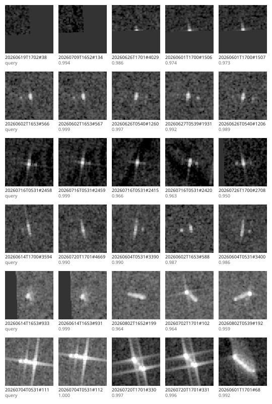

# Dark Vessel Detection

**Detecting undeclared vessels by fusing Sentinel-1 SAR imagery with AIS records over Danish waters.**

[](https://github.com/esamoun/dark-vessel-detection/actions/workflows/ci.yml)

> **Status — work in progress.** The chain runs end to end today on real data at both ends: a real
> Sentinel-1 scene, and a real day of the Danish Maritime Authority's AIS archive. Three commands
> in — the scene, the declarations, the chain — and a georeferenced GeoPackage out that opens in
> QGIS where it should. It tiles a scene larger than one tile and reports a target sitting on a
> tile boundary exactly once. The study area is now measured rather than picked, and sits on the
> Kattegat shipping lane: the latest run has six commercial ships in one frame, four of them
> trailing a wake. The trained detector took the bright-pixel stand-in's place in the chain on
> 2026-08-16 — six detections for six hulls and none on open water, where the threshold reported
> the same six sixteen times — and the problem that run surfaced is fixed: a ship making twelve
> knots is imaged half a kilometre from where it declared itself, so the declaration is moved to
> where the radar would have drawn it before anything is matched, which took this scene from two
> matched vessels to five. The detector was then measured rather than assumed — five runs one line
> apart, of which one was kept, and the ticket's own three domain adaptations refuted at that
> resolution rather than left unproven.
>
> The kept rung now runs in the chain: six detections, six hulls, five matched and one dark on the
> Kattegat frame, the same six vessels the older detector found and every score higher — and at the
> threshold this chain runs, the older weights would have returned four of the six. What is not
> done: the chain has run on one scene; offshore structures are not yet told apart from vessels, so
> a dark candidate here is not yet a finding about the sea; and the older detector's numbers are
> still what most of the scene-level analysis below was established with.
> [`docs/evaluation.md`](docs/evaluation.md) is the honest account of how well the detector works,
> where it breaks, and the ten conditions it has never been asked to work under. See
> [Approach](#approach) for what is real and
> what is not, [what the first run on the lane showed](#what-the-first-run-on-the-lane-showed--2026-08-14),
> [Training the detector](#training-the-detector) and [the ladder](#the-ladder--2026-08-23).

---

## The problem

Ships are legally required to broadcast their position over AIS (Automatic Identification
System). Some do not: the transponder is switched off, spoofed, or simply absent. These are
*dark vessels*, and they matter — illegal fishing, sanctions evasion, unreported transfers at sea.

Radar sees them anyway. Sentinel-1 acquires C-band SAR regardless of cloud or darkness, and a
metal hull on water is a strong scatterer against a near-black background. Detect every vessel in
the radar scene, match those detections against what AIS declared at the exact moment of
acquisition, and whatever is left over is a vessel that did not announce itself.

## Approach

The pipeline is built in four levels, each one shippable on its own.

| Level | What it does | Status |
| --- | --- | --- |
| **1 — Detector** | Supervised CNN detector trained on labelled SAR scenes; honest precision/recall and failure analysis | trained, then measured a rung at a time: R1 gives 0.95 precision at 0.73 recall over a held-out split of 3000 sub-images, and the three changes that did not clear the noise are written up rather than removed |
| **2 — Full-scene chain** | Inference over an entire Sentinel-1 scene: overlapping tiles, cross-tile deduplication, georeferenced GeoPackage output | runs on a real scene with the trained detector in it, since 2026-08-16 |
| **3 — AIS fusion** | AIS positions interpolated to acquisition time, spatio-temporal matching, unmatched detections flagged as dark | **complete.** Runs on real Danish archives over a measured study area, with the azimuth shift of a moving ship compensated before matching; detections are described by a representation learned without labels, and retrieval across ten weeks of acquisitions returns the same object 71% of the time against 0.02% at chance. Offshore structures are separated from vessels and excluded from the dark count without a single label: 65 fixed positions found by recurrence across 47 acquisitions, every one of them verified against published coordinates to 5.1 m, taking 80.5% of the detections a run over the wind farm would have had to explain |
| **4 — Spatial analysis** | Where dark vessels concentrate: distance to shore, bathymetry, EEZ boundaries, fishing effort | three of the four variables are sampled server-side and travel on the detections, run against the live catalogue on the Kattegat scene; EEZ boundaries are not in Earth Engine's public catalogue and read `unavailable` until one is ingested, and the analysis these columns feed is not started |

The chain that carries these was built first, deliberately, with a deterministic stand-in where
the detector would go; the stand-in is still there, behind the same parameter, and is what the
tests and the synthetic run use. What runs today: scene in, detector injected at the pipeline
boundary, the scene cut into overlapping tiles and the targets they see reconciled into one list,
pixel coordinates converted to ground coordinates, each declared vessel interpolated along its
track to the moment of acquisition and the detections matched against those positions within a
stated tolerance, GeoPackage out. Both ends of that are real now: a Sentinel-1 acquisition fetched
clipped from Earth Engine, and a day of the Danish AIS archive streamed, filtered and cleaned
with every removal counted, and the detector between them is the trained one. Detections standing
at a known fixed structure are taken out of the dark count and say so in the layer. What keeps a
dark result from being a finding about the sea is now one thing rather than three: it has run on
one scene of one study area.

A vessel moves between its last AIS report and the instant the radar images it: at 12 knots, some
370 m a minute, which is more than the match tolerance. Comparing a detection against a report
taken as it stands therefore manufactures dark vessels that were never there, and that is the
most likely way for this project to produce a confidently wrong answer. Each vessel is placed at
the acquisition timestamp before anything is compared. Where its track gives nothing to
interpolate between — it ends before the radar looks, or the vessel reported once — the nearest
report is used and the row says so, in `position_basis`. Nothing is extrapolated past a track:
prolonging one from a course and speed derived from earlier points would manufacture a position
where no measurement exists.

A vessel on a tile boundary is seen by two tiles and must be reported once. That is done by
ownership rather than by merging detections after the fact: each tile answers for one slice of
the scene and stays quiet about the rest, so the count is right by construction and there is no
merge radius to tune. The reasoning, and the one condition it places on the config, are in
[`docs/decisions.md`](docs/decisions.md).

Two deep learning components sit inside this:

- **Supervised object detection** on SAR. The hard parts are genuinely hard — vessels are a few
  pixels wide at 10 m resolution, the background/foreground imbalance is extreme, pretrained RGB
  backbones have to be adapted to single-channel radar amplitude, and only geometry-preserving
  augmentations are physically valid on SAR.
- **Self-supervised contrastive embeddings** over detection crops. Offshore wind turbines are
  bright point scatterers that look a great deal like ships, and an unsupervised embedding space
  does separate them into distinct clusters without any additional labelling — measurably, at
  0.768 against 0.5 at chance. It turned out not to separate them *well enough to delete a
  detection on*, so the exclusion is built on where a thing stands over ten weeks rather than on
  what it looks like, and the measurement that settled it is
  [below](#telling-a-turbine-from-a-ship--2026-08-27). The embedding earns its place as a
  similarity-search index over the detection archive and as the evidence that the clusters exist.

Everything else — AIS interpolation, spatio-temporal matching, contextual analysis — is
geospatial data engineering, not deep learning, and is described as such.

## Data

| Source | Use | Access |
| --- | --- | --- |
| Sentinel-1 GRD | SAR imagery | Copernicus Data Space / Earth Engine `COPERNICUS/S1_GRD` |
| Danish Maritime Authority AIS | Declared vessel positions | open daily archives, `aisdata.ais.dk` |
| LS-SSDD-v1.0 | Detector training | 15 large Sentinel-1 scenes, VV, cut into 9000 labelled sub-images |
| Earth Engine catalogue | Bathymetry, EEZ, coastline, fishing effort | Google Earth Engine |

Study area: **Danish waters** — dense and varied traffic, excellent Sentinel-1 revisit as a
Copernicus priority zone, and freely available raw AIS.

Within them, a 17 km box in the northern Kattegat on the approach to Skagen, and the box is
measured rather than picked. `darkvessel survey` streams a day of Danish AIS and ranks every
rectangle of that size in the Kattegat by how many vessels of 100 m or more, under way, stand
inside it in a given half hour. This one holds five or six at an arbitrary instant and is never
empty. The first study area was chosen off a map for its wind farm, which put it in quiet water
where the largest vessel ever imaged was 15 m; the whole argument, and what the move gives up,
is in [`docs/decisions.md`](docs/decisions.md).

## Repository layout

```
src/darkvessel/
  pipeline.py the single seam: scene + AIS + injected detector -> classified detections
  cli.py      the one command; builds the detector and hands it to the pipeline
  data/       study area and the survey that chose it, Sentinel-1 export, Danish AIS archives
              and ingestion, published offshore-structure coordinates, tiling, fixtures
  detect/     detector contract, labelled dataset and augmentations, model, training,
              checkpoints and resume, precision/recall, inference, pixel->geo
  embed/      detection crops, contrastive views and training, the archive they
              accumulate in, nearest-neighbour retrieval and its checks, finding the
              fixed structures the archive holds and verifying them
  fusion/     AIS interpolation to acquisition time, spatio-temporal matching, the
              register of fixed structures a run will not call dark vessels
  context/    contextual variables sampled at each detection: distance to shore, water
              depth, EEZ membership, fishing effort
  viz/        GeoJSON export for the web map
configs/      pipeline configuration
data/reference/  published structure coordinates, and the register built from the archive
notebooks/    exploration and Kaggle/Colab training entry points
tests/        unit tests for the geometry-critical paths
docs/         decision log and failure log
```

## Related work

This is a known and actively worked problem, not an invented one. The task is the subject of a
public detection challenge on Sentinel-1 with AIS-derived labels, of an established research
literature on SAR ship detection, and of operational commercial services. Prior art is listed
in [`docs/related-work.md`](docs/related-work.md) as it accumulates.

What is specific here is the instance rather than the task: this study area, an AIS ingestion and
interpolation pipeline built from raw national archives, the contextual analysis layer, and
embedding-based disambiguation of vessels from fixed offshore structures.

## Engineering notes

Constraints are stated rather than hidden. Training runs on free-tier cloud GPUs with short,
resumable sessions and checkpointing from the first epoch. The training subset is deliberately
scoped and documented. Where results are modest, they are reported as modest — a detector that
usefully ranks candidates for inspection is a different and more honest claim than a detector
that maps them.

- [`docs/evaluation.md`](docs/evaluation.md) — how well the detector works, and where it breaks
- [`docs/decisions.md`](docs/decisions.md) — why each choice was made
- [`docs/failures.md`](docs/failures.md) — what was tried and did not work

## Setup

```bash
conda env create -f environment.yml
conda activate darkvessel
pip install -e ".[dev]"
```

Training and Earth Engine dependencies are extras — `".[detector]"` and `".[gee]"` — and are not
needed to run the pipeline.

## Running the chain

No credentials, no downloads, no weights:

```bash
darkvessel synthesise --out data/synthetic
darkvessel run --config configs/pipeline.yaml
```

```
5 detections in EPSG:25832 -> outputs/detections.gpkg
  4 matched, 1 dark at a tolerance of 200 m
  of those matches, 1 on a position interpolated to the acquisition and 3 on a report taken as it stands
```

One of those five is a vessel under way, 900 m west of its target three minutes before the
acquisition and 600 m east of it two minutes after. Neither report stands within the tolerance;
the interpolated position lands on the target. Matched against a report as it stands, it comes
back as a dark vessel that was never there.

### On a real Sentinel-1 scene

This one needs Earth Engine credentials, and is the only part of the repository that does.

```bash
pip install -e ".[gee]"
earthengine authenticate                              # once; set your project in the config
darkvessel survey --config configs/survey.yaml        # where the traffic is
darkvessel export --config configs/kattegat-lane.yaml # the scene
darkvessel ais    --config configs/kattegat-lane.yaml # what declared itself in it
darkvessel run    --config configs/kattegat-lane.yaml # the chain
```

The embedding level is six more commands over the same water. Only `scenes` needs Earth Engine
credentials and only `known` needs any other network; the last one needs neither, and neither a
GPU nor the framework:

```bash
pip install -e ".[detector]"
darkvessel scenes     --config configs/embeddings.yaml  # ten weeks, two rectangles
darkvessel crops      --config configs/embeddings.yaml  # every detection, cut out
darkvessel embed      --config configs/embeddings.yaml  # fitted, without labels
darkvessel retrieve   --config configs/embeddings.yaml  # what resembles what
darkvessel known      --config configs/embeddings.yaml  # published structure coordinates
darkvessel structures --config configs/embeddings.yaml  # the register, verified
```

```
4676 crops from 96 scene(s): 318 distinct positions, 65 of them standing in 20+ acquisitions
  kattegat-lane: nothing published in this box, and 0 structure(s) registered from it
  anholt: 65 of 66 published positions carry a registered structure and 65 of 65 registered structures stand at a published position, 5.1 m apart at the median, within 200 m
  published at 0.9: 782 of 972 detections stand at a registered structure (80.5%), leaving 190
```

`survey` is the command that chose the study area, and it needs no credentials — only the AIS
archive. It streams one day of Danish AIS and ranks every rectangle of the study area's size in
the Kattegat by how many vessels of 100 m or more, **under way**, stand inside it during a half
hour — the same half hour `ais` fetches — averaged over every half hour of the day, empty ones
included. Each of those qualifications is load-bearing, and each of them is a way the first study
area was chosen wrongly; the argument is in [`docs/decisions.md`](docs/decisions.md).

```
vessels of 100 m or more, under way, in 0.3 x 0.15 degree rectangles over 2026-08-09
   11.00  57.55  to  11.30  57.70     91 over the day   4.75 in a window  fewest   2     0 windows empty
   11.45  57.25  to  11.75  57.40     88 over the day   4.54 in a window  fewest   2     0 windows empty
   10.95  57.55  to  11.25  57.70     91 over the day   4.50 in a window  fewest   2     0 windows empty
```

`export` asks Earth Engine for one acquisition over that rectangle, already clipped to it and
reprojected into the working CRS, and writes a single GeoTIFF carrying its acquisition time,
scene id, polarisations and orbit pass. Clipping and reprojection happen on Google's machines,
and no GRD product reaches the local disk: a single response is two orders of magnitude smaller
than a whole product, and an area that would ask for one is refused before the request is sent.
The shipped area came back as 1845 x 1727 px in VV — 22 MB, and sixteen tiles at 512/64 with real
seams between them rather than the four the synthetic scene has. VV only is what the larger box
costs; the trade is stated in the config and in the decision log.

`ais` fetches the Danish Maritime Authority's archive for the day of that acquisition — the
acquisition instant is read off the scene, so the two cannot describe different moments — and
filters it down to the study area and a quarter of an hour either side. The archive for this day
is 662 MB compressed and 3.3 GB of CSV; it is inflated off the network a chunk at a time and
never stored, so what stays on disk is the reports that survive:

```
declared positions around 2026-08-09T05:31:24+00:00, from kattegat-lane.tif
  29718190 position reports read, 53320 of them with no usable position
  3687 in the study area and the window, 0 more inside the area with no readable timestamp
  of those, 2135 removed by cleaning: 0 not a vessel, 0 with no nine-digit identifier, 2129
  duplicated, 6 contradicting another report of the same instant, 0 at a position the rest of
  their own track cannot reach
  1552 declared positions kept
```

More than half of what reached the cleaning was the archive repeating itself. Every rule's count
is printed because a slice is a claim about which vessels declared themselves, and it is only as
good as what was thrown away on the way to it.

```
16 detections in EPSG:25832 -> outputs/kattegat-lane.gpkg
  2 matched, 14 dark at a tolerance of 200 m, against 12 declared positions
  of those matches, 2 on a position interpolated to the acquisition and 0 on a report taken as it stands
```

#### What the first run on the lane showed — 2026-08-14

Scene `S1C_IW_GRDH_1SDV_20260809T053124_…`, acquired 2026-08-09 05:31:24 UTC, descending, VV,
1845 x 1727 px over the northern Kattegat, against the Danish archive for that day.

**The study area works.** Six bright objects in the frame, four of them trailing a visible wake.
Twelve vessels declared themselves inside the searched area, ten of them 100 m or longer and the
largest 337 m; six stood inside the study rectangle itself at the acquisition instant, five of
those 100 m or more and the largest 274 m. Against the old box, where the largest vessel ever
imaged over five weeks was a 15 m sailing boat, this is the difference the move was made for.

**Checked by eye, 2026-08-14.** `outputs/kattegat-lane.gpkg` opened over the scene itself, VV
rendered from −25 to 0 dB and the detections drawn as hollow outlines so the pixel under each one
stays visible. Every detection sits on a bright object against a uniform speckled sea at −21.8 dB
median, and there is no land and no fixed structure anywhere in the frame. The 16
detections resolve to **6 objects** when anything within 200 m is treated as one, which matches
the six bright objects visible in the image exactly. The extra rows are one object each: the
larger ships come with a cross of sidelobes bright enough for the threshold to report the arms as
separate targets, so a 274 m vessel arrives as eight detections. That is the placeholder
detector's problem, and it is the same one the wind farm showed at Anholt.

**Two matched, and both of them make sense.** A 228 m vessel making 0.0 knots matched at 41 m —
which is geolocation error and a centroid, and nothing else. A 24 m vessel making 2.6 knots
matched at 116 m.

**The other four are not dark, and finding out why is what this scene was for.** The fourteen
dark detections belong to four vessels, and every one of them stands 341–632 m from a declared
vessel of 140 m or more. The offsets are not scattered. The first two rows below are the two
matches, shown because they are the contrast that makes the pattern readable:

| MMSI | Length | Speed | Course | Offset | Bearing of the offset |
| --- | --- | --- | --- | --- | --- |
| 538002621 | 228 m | 0.0 kn | — | 41 m | 248° |
| 219025245 | 24 m | 2.6 kn | 285° | 116 m | 001° |
| 255805577 | 140 m | 13.4 kn | 317° | 475 m | 000° |
| 636026410 | 274 m | 12.8 kn | 137° | 480 m | 176° |
| 667002360 | 244 m | 11.6 kn | 316° | 493 m | 353° |
| 636021202 | 233 m | 13.1 kn | 135° | 514 m | 175° |

Every displacement points north or south whatever the ship's course, and which of the two depends
on whether the ship is closing on the sensor or opening from it. The vessel making no way is not
displaced; the one making 2.6 knots is displaced by 116 m; the four making twelve knots are
displaced by half a kilometre. This is the SAR azimuth shift — a moving target is imaged
displaced along the azimuth direction by `(R / V) · v_radial` — and the numbers above imply an
`R / V` of about 115 s, which is Sentinel-1's.

So the honest reading of `2 matched, 14 dark` is that the chain is correct, the tolerance is not,
and the term that dominates the error budget is one that could not be measured until there were
moving ships in the frame. The tolerance stays at 200 m and stays labelled provisional: widening
it to 600 m would match these four for the wrong reason and hand every genuinely undeclared vessel
a 600 m radius in which to find an explanation. Predicting the shift from each vessel's own
declared course and speed is a level of its own, and it now has its measurements.
[`docs/failures.md`](docs/failures.md) has the full account.

What earlier real runs caught is in [`docs/failures.md`](docs/failures.md), one entry each: the
chain read the product's nodata fill as the brightest targets in the scene; the export's size
guard was sized from an assumed dtype and then, on a second reading, from a ceiling nobody had
measured, so it let through the very request Earth Engine refused; the AIS outlier rule removed
the evidence along with the noise; and the first AIS slice ingested was empty — which the chain
correctly, and unreadably, reported as 115 dark vessels.

`outputs/detections.gpkg` opens directly in QGIS, in EPSG:25832. Each detection carries its
`status` (`matched` or `dark`), the `mmsi` that explains it if one does, that vessel's declared
`length_m`, the distance to its declared position, the `tolerance_m` the decision was made at,
and `declarations_searched` — how many declared positions that radius was applied to. Both
numbers are part of the result, because "dark" is a claim about a search: without the radius it
cannot be read at all, and without the count a scene where nobody declared themselves is
indistinguishable from a scene full of ships that switched their transponders off. The length is
there for the same reason from the other side: at 10 m pixels a 15 m hull is a pixel and a half,
so a scene of small craft and a scene of cargo are different claims about what the radar could
have seen at all. A match also carries what the position it
matched was built from: `position_basis` is `interpolated` or `reported`, and `position_age_s`
is how far the nearest real report sits from the acquisition. A match against a position
constructed at the acquisition instant and one against a report five minutes old are different
claims, and the row says which it is rather than leaving it to be assumed.

The run is defined by the config file. `configs/pipeline.yaml` names the scene, the AIS slice,
the output, the tile size and overlap to run the detector at, which detector to inject, the match
tolerance and the widest gap in a track a position may be interpolated across; the pipeline itself
never knows which detector it got. One of the five synthetic targets stands exactly where the
tiles that config cuts the scene into meet, so the shipped run crosses a seam rather than only the
tests.

```bash
make test    # the seam: georeferencing, tiling, matching and export, offline and deterministic
make lint
```

The export is tested with Earth Engine faked — the catalogue is a parameter, the same seam that
lets the pipeline run without a detector. What that cannot check is whether Earth Engine's own
filters select what this code believes they select; that is verified by hand on the first real
export and recorded here rather than asserted in a test that could not fail.

Both run on every push and pull request, from
[`.github/workflows/ci.yml`](.github/workflows/ci.yml) — the same two commands, not a second
definition of them. Lint runs on Python 3.11; the tests run on 3.11 and 3.13.

## Training the detector

This is the one part of the project that needs a GPU, and it does not run here: the development
machine is an 8 GB M1 laptop, so training happens on a Kaggle free tier where the labelled data
is already attached and never touches the local disk. What is in the repository is the run —
`darkvessel train --config configs/train.yaml`, driven by a config file like every other stage,
with [`notebooks/kaggle-train.ipynb`](notebooks/kaggle-train.ipynb) as a four-cell wrapper that
clones, installs and calls it.

### The first run — 2026-08-14

12 epochs on a Kaggle T4, about 13 minutes each. The run was interrupted after the first epoch and
the next session continued at the second, which is what the whole design is for. Numbers below are
from the saved `metrics.json` of the final epoch, scored over the **entire** held-out split —
scenes 11 to 15, 3000 sub-images, 2378 ships, empty tiles included.

| Score threshold | Precision | Recall | Found | False | Missed |
| --- | --- | --- | --- | --- | --- |
| 0.25 | 0.578 | 0.867 | 2062 | 1507 | 316 |
| 0.50 | 0.808 | 0.789 | 1877 | 445 | 501 |
| **0.75** | **0.941** | **0.706** | 1680 | 106 | 698 |
| 0.90 | 0.986 | 0.535 | 1272 | 18 | 1106 |

It trained on 2246 of the 6000 sub-images cut from scenes 1 to 10: every one of the 1123 carrying
a ship, plus 1123 of open water. Those 1123 tiles hold 3637 ships and the held-out split 2378 —
6015 between them, which is the total LS-SSDD publishes, so nothing was dropped on the way in.

Two things about this run are worth more than the table.

**It did not converge, it oscillated.** The training loss fell from 0.181 to 0.136 and then sat
there, while precision at a fixed threshold of 0.50 went 0.55, 0.74, 0.75, 0.41, 0.64, 0.84, 0.65,
0.28, 0.80, 0.63, 0.53, 0.81 across the twelve epochs. Adjacent epochs differ by a factor of
three. The learning rate is constant with no decay, so the model reaches the neighbourhood of a
minimum in three epochs and bounces around it for nine more; what moves is the calibration of its
scores rather than the quality of its detections. The loss curve says nothing about any of this —
it is the held-out split, scored every epoch, that shows it. Epoch 9 was better than epoch 12
(F1 0.817 against 0.807) and `keep: 2` had already deleted it.

**The same config ran twice and produced two different detectors.** Kaggle's *Save Version*
re-executes the whole notebook in a fresh machine, so the console log and the saved artefact came
from two complete runs — and they disagreed on every epoch, because the seed named the data and
not the model. The detection head is built fresh and drew from an unseeded generator. Fixed, and
both findings are written up in [`docs/failures.md`](docs/failures.md).

The labels are **LS-SSDD-v1.0**: 15 large Sentinel-1 IW acquisitions, VV, cut by its authors into
9000 sub-images of 800 x 800, ships labelled by SAR experts against AIS and Google Earth. It is
chosen because its physics is this chain's physics — same satellite, same 10 m pixel, the same
problem of a hull three pixels across against an enormous empty sea. The higher-resolution sets
were rejected for the opposite reason: at 0.5 m a ship is a hundred pixels with a superstructure,
and those are not the features available here.

Four decisions in it are worth stating, because each one is a way to report a number that is not
true:

- **The split is drawn by scene, never by sub-image.** Two 800 px cuts of one acquisition share a
  sea state, an incidence angle and a speckle distribution, and a ship on the seam is in both.
  LS-SSDD's own split — scenes 01–10 against 11–15 — is used as published, so the numbers are
  comparable to the baselines rather than only to themselves.
- **Only the training side is cut down.** Every tile carrying a ship is kept, plus one empty tile
  per ship-bearing tile, because free-tier hours are the binding constraint. The held-out split is
  scored entire: the empty tiles are exactly where a false positive happens, and dropping them
  would report a precision the detector had not earned.
- **Augmentations move pixels and never change them.** Flips and quarter turns, the eight
  symmetries of the square. Amplitude on radar *is* the measurement, so a contrast jitter does not
  produce a second look at the same ship — it produces a ship made of a different material. The
  test for this asserts the property rather than the list: the sorted pixel values of a tile come
  back identical after any augmentation the code is allowed to apply.
- **A detection is scored against the tolerance the fusion will apply to it** — 200 m, in metres,
  read into pixels through the resolution — rather than by box overlap. At 10 m a 60 m vessel is
  six pixels, so an IoU score here mostly measures a box no part of this chain uses. It is also
  the generous reading, and it is in the config in the open for that reason.
- **Where the annotations start counting is measured, not assumed.** VOC boxes are inclusive
  pixel indices and the file does not say whether they count from zero or from one; the two
  readings differ by a pixel, which on a four-pixel ship is a quarter of the target, in the same
  direction for every ship, visible nowhere. An index of 0 cannot occur in a set counting from
  one and an index equal to the width cannot occur in one counting from zero, so the boxes settle
  it themselves. Where they cannot — a subset too small to contain either — the load refuses
  rather than defaulting.

The architecture is a stock Faster R-CNN with a two-class head, and its anchors are torchvision's
own. The smallest is 32 px, a 320 m vessel at 10 m, longer than nearly everything in the training
set — so the expectation written here before the first run was that recall would be poor. It was
not: 0.71 at a precision of 0.94. An anchor is where the region proposal network starts regressing
from, not a filter on what it can return, and on the high-resolution level of the pyramid a 32 px
anchor reaches hulls of a few pixels perfectly well. The prediction was wrong and the reasoning
behind it was too strong; the decision to ship the stock sizes stands, because the ticket that
adapts them has to measure each change against the configuration before it, and this is that
configuration. `anchor_sizes` is a config key.

The run is built for being interrupted rather than for finishing. Checkpoints are written every
epoch, under a temporary name and moved into place in one step, so a kernel stopped halfway
through writing 300 MB leaves the last good epoch standing instead of a truncated file that the
next session resumes from. Weights are written *before* the held-out split is scored: an
interrupted evaluation costs numbers that can be recomputed, an interrupted checkpoint costs an
epoch that cannot. And a resumed session is the same run, not a similar one — which empty tiles
the subset kept, which way each tile is laid down and the order they arrive in are all derived
from one seed and the epoch number rather than from a generator's position in a stream.

That claim is checked rather than asserted. `tests/test_training_run.py` runs the real loop and
the real model builder on the CPU over eight tiles, kills the session after one epoch, and
requires a second session with freshly initialised weights to continue at epoch 2. It is skipped
where torch is not installed, which includes CI — the chain's acceptance condition is that it
installs and runs without a framework, and the suite is honest about running without one.

Everything that can be got wrong quietly is on the torch-free side of that seam and is tested in
CI: the split, the subset, the augmentations, the counting, and the resume bookkeeping. Only the
architecture and the loop itself need the framework.

```bash
pip install -e ".[detector]"
darkvessel train --config configs/train.yaml   # locally: proves it starts, then use Kaggle
```

The reasoning behind each of these is in [`docs/decisions.md`](docs/decisions.md).

### The ladder — 2026-08-23

Issue #11 asks for three adaptations for small targets and extreme imbalance. Measuring them is
the hard part, and the first run is why: at a learning rate that never decayed, precision at a
fixed threshold went 0.55, 0.74, 0.75, 0.41 … 0.28, 0.80 across twelve epochs. Adjacent epochs
differed by more than any of the three changes was likely to be worth, so comparing one final
number against another would have described the draw rather than the change — with three decimal
places, which is worse than describing nothing.

So the rule was written and committed on 2026-08-17, before any of these runs existed: **a change
is kept only if it beats the previous kept configuration by more than the noise that configuration
was already showing.** The noise is measured, not assumed — the spread of the statistic over a
run's last four epochs. A threshold chosen after seeing the numbers is a narration of them.

Five runs of twelve epochs, one line different each, every one scored over the same held-out
scenes 11 to 15 — 3000 sub-images, 2378 ships. `darkvessel compare --config configs/ladder.yaml`
reads the five journals in [`docs/runs/`](docs/runs/) and prints:

| Rung | What changed | Best F1 | Against | Band | Gain | |
| --- | --- | --- | --- | --- | --- | --- |
| R0 | nothing — the baseline, re-run under the corrected seeding | 0.807 | — | — | — | kept |
| R1 | cosine decay of the learning rate | 0.836 | R0 | 0.026 | +0.028 | kept |
| R2 | `anchor_sizes` to `[[4], [8], [16], [32], [64]]` | 0.788 | R1 | 0.010 | −0.048 | rejected |
| R3 | single-channel stem | 0.836 | R1 | 0.010 | −0.000 | rejected |
| R4 | `rpn_batch_size_per_image` 256 → 32 | 0.827 | R1 | 0.010 | −0.009 | rejected |

**One change of five was kept, and it is the one that is not among the ticket's three
adaptations.** Cosine decay bought +0.028 and, more usefully, cut the noise band from 0.026 to
0.010 — the baseline reached the neighbourhood of its optimum by epoch 3 and bounced there for
nine more, and R1 climbs instead: 0.828, 0.826, 0.833, 0.836 over its last four.

The three adaptations gave, in order, a clear harm, a draw to five decimal places, and a draw
inside the noise. Each has its numbers and its mechanism in
[`docs/failures.md`](docs/failures.md):

- **R2, the small anchors.** The realised positive-anchor fraction falls from 16.8% to 1.4%, so
  the RPN's sampler fills a batch of 256 with about 3.6 positives instead of about 43 and the head
  has an order of magnitude fewer examples from which to learn confidence. The anchor census
  predicted this in writing on 2026-08-19, before any rung ran.
- **R3, the single-channel stem.** 0.83556 against R1's 0.83557. The folded stem agrees with the
  three-copy repeat inside the tile at initialisation and differs only over a three-pixel border,
  so a near-null was expected; it arrived nearer to null than anyone would have bet. The three
  copies were not costing anything, and that is a measured answer rather than an assumed one.
- **R4, the RPN sampler.** −0.0087 against a band of 0.0099 — the change is smaller than the noise
  it had to beat, which makes it a draw rather than a harm. What it demonstrably did do is widen
  the band to 0.019, the noisiest run on the kept branch: sixteen positives and sixteen negatives
  per image is a noisier gradient than 43-odd positives out of 256.

Training losses are not comparable across rungs that move the anchors or the sampler, and both
directions of that trap appear here: R2's final loss is 0.044 against R1's 0.117 on a detector
that is measurably worse, and R4's first epoch is the highest of the five because a balanced
sample is a harder one.

**What the kept configuration does.** R1 at epoch 12, over the entire held-out split:

| Score threshold | Precision | Recall | Found | False | Missed |
| --- | --- | --- | --- | --- | --- |
| 0.25 | 0.529 | 0.928 | 2206 | 1964 | 172 |
| 0.50 | 0.710 | 0.886 | 2107 | 859 | 271 |
| **0.75** | **0.848** | **0.824** | 1959 | 352 | 419 |
| 0.90 | 0.950 | 0.713 | 1695 | 90 | 683 |

Against the 2026-08-14 baseline at the same threshold — precision 0.941, recall 0.706 — the
schedule trades precision for a good deal more recall: 279 more ships found, 246 more false
detections. F1 0.836 against 0.807.

**What is left standing.** Almost no ship reaches an IoU of 0.7 against any anchor, in either
anchor set — which points at the RPN's foreground IoU threshold rather than at anchor geometry or
sampler batch size. Two rungs have now failed in the region that hypothesis describes and neither
tested it, because the five rungs were fixed before the census that produced it. It is the first
thing a sixth rung should change, and this ladder deliberately does not have one; it is now
[issue #24](https://github.com/esamoun/dark-vessel-detection/issues/24).

```bash
darkvessel compare --config configs/ladder.yaml
darkvessel evaluate --metrics docs/runs/r1-cosine-rerun.json --svg docs/figures/precision-recall-r1.svg
```

The second of those draws the kept rung's whole precision-recall curve, with the range each point
covered over the last four epochs.
[`docs/evaluation.md`](docs/evaluation.md) reads it: where the chain sits on that curve and what
it pays, what the 651 missed ships are actually made of — 542 of them are found by the detector
and discarded by the threshold — the failure modes by cause, and the ten conditions none of this
has ever been tested under. It reads the **second** execution of R1, which is the one the chain
loads; the table above is the first, which is the one the ladder judged. Why there are two, and
what they agree on, is in [`docs/decisions.md`](docs/decisions.md) under 2026-08-26.

## Swapping it into the chain — 2026-08-16

The trained model now satisfies the same `detector` parameter the threshold stand-in satisfies,
and no other stage changed. That is what the seam was built for, and this is where it paid.

> **Which weights, and which numbers.** The tables in this section were produced by the detector of
> 2026-08-14 at a score threshold of 0.75. The chain now loads R1's weights — the one rung of
> [the ladder](#the-ladder--2026-08-23) that was kept — at a threshold of 0.90, where R1 gives the
> precision this swap was decided on.
>
> Those weights have been run over this frame since 2026-08-26, and they return the same six
> vessels by MMSI with every score higher: 0.850 → 0.976 on the 274 m hull, 0.862 → 0.927 on the
> 24 m one. At 0.90 the older detector would have returned **four** of the six, dropping the
> largest vessel in the frame and the smallest. What has not been repeated under them is the rest
> of the analysis below — the count of objects checked by eye, the sidelobe stack, the decibel
> sweep — all of which belongs to the older detector.
>
> They are also not the weights the ladder judged: that session was lost before its checkpoint was
> ever saved, so R1 was executed a second time from the same config and the same seed.
> `docs/decisions.md`, 2026-08-26, measures what the two executions agree on — including that the
> ladder returns the same verdict on all five rungs under either.

```bash
darkvessel run --config configs/kattegat-lane.yaml
```

Nine seconds on an 8 GB M1 laptop: nine tiles of 800 px, no GPU.

### What it found, against the baseline

Six vessels declared themselves inside this scene at the instant it was acquired. Both detectors
are scored below against where those six actually appear **in the radar image**, which is not
always where they declared themselves — see the caveat under it.

| | Detections | Hulls found | Detections on no hull |
| --- | --- | --- | --- |
| Threshold at 0 dB | 16 | 6 / 6 | 2 |
| **Trained, score 0.75** | **6** | **6 / 6** | **0** |

The baseline was not blind — it found all six. It reported them sixteen times: the stack of nine
detections inside one 200 m square in the north-west was a single bright hull counted nine times,
because a threshold has no notion of what a vessel is and reports every connected bright region
it meets. The trained model reports each hull once and adds nothing.

### Why the radar's positions are not the declared ones

Scoring against radar positions rather than declared ones is not a convenience. Four of the six
vessels are imaged **420 to 490 m from where AIS puts them**, almost purely north–south, because
Sentinel-1 displaces moving targets along its own track: a vessel closing on the radar adds
Doppler of its own, and nothing in the processing can tell that apart from Doppler caused by
position. The two the chain originally matched are exactly the two whose displacement stayed
inside the 200 m tolerance, and the one vessel with no east–west velocity is displaced by nothing
at all. The measurement, including that control, is in [`docs/failures.md`](docs/failures.md).

### Correcting it — matched vessels, 2 → 5

The declaration is now moved to where the radar would have drawn the vessel, before matching,
using the velocity the AIS track already carries. The tolerance stays at 200 m — widening it
instead would buy the four accusations back by making every match looser, and a genuinely dark
vessel passing near a declared one would be quietly explained away.

| | Matched | Dark |
| --- | --- | --- |
| No correction | 2 | 4 |
| Corrected | **5** | 1 |

The direction comes off the product's `ORBIT_PASS` tag. The magnitude needs the incidence angle,
which the product does not carry, so `fusion.azimuth.incidence_deg` declares it — 38.5°, the
middle of an IW swath, and an approximation stated in the open.

The sixth vessel is not recovered, and it is not recoverable by tuning: 34° gives four matches,
38.5° and 43° give five, 46° over-corrects back to four. The residual is in the bearing or in
where a detection's centroid falls, and six vessels found with a pixel-resolution peak finder
cannot separate those. Picking the incidence angle that made the sixth match would be fitting the
geometry to the answer, which is the one thing this correction must not do.

### The window between decibels and amplitude

The gap recorded on 2026-08-14 is closed. The chain exports calibrated decibels, the model was
fitted on 8-bit amplitude over 255, and the stretch between them is not recoverable from the
dataset — so it was chosen, and half of it was chosen by measurement.

LS-SSDD's sea sits at **0.2000**, measured over 2,234 offshore held-out tiles outside the
annotated boxes. Putting this scene's sea (−21.84 dB) there fixes one end of the window. The
other end could not be measured: matching the *spread* of the two seas would set the width from
how grainy each product is, and LS-SSDD's sea is three times grainier than this GRD — a
difference in multi-looking, not in stretch. So the width was swept from 25 to 60 dB against the
declared vessels; every width from 25 to 45 recovers all six hulls and 50 upwards starts losing
them. 40 dB is the middle of what works, and the shipped window is −29.84 to +10.16 dB.

That is one free parameter tuned on the scene it is then reported on. It is written down as that.
The numbers that carry weight are still the held-out LS-SSDD table above.

## Describing what it found — 2026-08-26

The chain says where the vessels are. It says nothing about what they are, and it never will:
there are no labels for that, and there is no prospect of any. What there is instead is a lot of
unlabelled detections, and a way of learning from exactly that.

A second, small model is fitted on the crops the detector returns, with no labels anywhere in it.
What supervises it is a statement rather than an annotation: two views of one crop are the same
object, and two views of different crops are not. Which transformations may stand between the two
views is therefore the whole specification, and radar narrows it sharply — colour and contrast
jitter have no physical meaning on a backscatter coefficient, so a view is one of the eight
symmetries of the square, a translation of a few pixels, and **speckle**, which is the one
value-changing augmentation the physics itself provides. A multi-looked intensity image carries a
fluctuation that is Gamma distributed with shape equal to the number of looks, so a second look at
the same sea is that sea times a draw from that distribution. The number of looks is measured on
the archive's own scenes rather than quoted: across fifty acquisitions it runs from 0.01 to 5.14
against a nominal 4.4, and the low end is not more speckle but less sea — a calm morning
backscatters at −37 dB, close enough to the noise floor that its variation in decibels is five
times a windy day's.

### The archive

One acquisition of the shipping lane holds six vessels, which is not an archive. So the level is
built on **two** rectangles, fifty acquisitions each, between 1 June and 9 August 2026, ascending
and descending both: the Kattegat lane the chain runs over, and the Anholt box the study area
moved off in August. Anholt was given up for having no ships in it; what it has instead is a
documented 111-turbine lattice, and an archive drawn from the lane alone can never show a
representation telling a turbine from a ship, whatever the representation does.

Both boxes are cut at a detector score of **0.05** rather than the 0.90 the chain publishes at.
That threshold was chosen for precision because every dark vessel the chain reports is a claim
someone may be sent out on; nothing here is published, and a representation fitted only on the
objects the detector was already certain about has never been shown the ones it was not. It comes
to **4,676 crops of 64 px from 96 acquisitions** — 348 from the lane and 4,328 from Anholt, which
is the imbalance you would expect from 111 fixed scatterers standing in every frame against five
or six ships passing through. Three Anholt clips held no water at all: Earth Engine's search asks
whether a footprint *intersects* the rectangle, not whether it covers it.

A hundred epochs, sixteen dimensions, a bit over an hour of laptop CPU. The detector needed a
rented GPU and several evenings. Both figures are worth stating.

**The turbines are in there, and that was checked before any method was written to find them.**
`python3 notebooks/recurrence.py` asks nothing of the embedding: it groups detections whose ground
positions fall within 100 m and counts how many acquisitions each standing position appears in. A
ship under way does not come back. A mast does.

| Positions seen in… | kattegat-lane | anholt |
| --- | --- | --- |
| 2+ acquisitions | 21 | 91 |
| 5+ | 2 | **69** |
| 10+ | 1 | **67** |
| 20+ | 0 | **65** |
| most persistent | 11 acquisitions | **46 of 47** |
| crops at a position seen 5+ times | 23 of 348 | **4,232 of 4,328** |

Sixty-five positions stand still across twenty acquisitions or more, one of them across 46 of the
47. The lane behaves as the control should — except for one position seen in 11 acquisitions, in
the box that is supposed to have no fixed structures in it. That is not a ship either, and it is
written down here rather than tidied away.

*(The last row of that table read `2,612 of 4,328` until 2026-08-27: the notebook summed
acquisition counts under a label that said crops. See [`docs/failures.md`](docs/failures.md).
The figure understated its own argument — 98% of the Anholt archive stands at a persistent
position, not 60%.)*

Those 65 positions are checked against the farm's published coordinates in the next section, and
they turn out to be 64 turbines and a transformer platform.

### What retrieval returns



Each row is one query and its four nearest neighbours in the representation, drawn through the
same decibel window so that two cells side by side are two crops in one unit. The six queries are
spread over the archive's range of apparent target size rather than picked by hand — choosing six
by hand is exactly where a flattering figure would come from.

The rows are coherent, and the top one is the most interesting. Those are detections standing on
the boundary of a hole in the product, and their neighbours are other detections on other holes in
other acquisitions. Nothing labelled them, nothing was told they exist, and they sit together —
which is the claim this level was built to support, made on the least glamorous class it could
have been made on.

### What the check says

| | measured | at chance |
| --- | --- | --- |
| A second view of a crop retrieves its object first | **0.066** | 0.0004 |
| The nearest neighbour is another cut of the query's own object | **71%** | 0.04% |
| The nearest neighbour is a different object in the same acquisition | 11% | — |
| The nearest *different* object differs in apparent size by | **6.0 px** | 16.0 px |

The first needs no labels at all, which is why it is recorded every epoch: a representation that
has collapsed onto a point still returns ranked neighbours with similarities near one for every
query, and scores at chance here. It is also the number that fell hardest when Anholt was added,
from 0.483 to 0.066, and reading that as a worse encoder would be wrong: telling *this* turbine
from its sixty-four identical siblings, through a view shaken by speckle, is a harder question
than the one-box archive ever asked. Put to the identical task — the same 348 lane crops, the same
twins, ranked against those same 348 — the one-box encoder scores 0.489 and this one 0.422. The
rest is the question, not the answer.

The third is a diagnostic rather than a result — the decibel window is fixed across the archive
and the sea under it runs from -37 dB to -11 dB, so a representation that had learned the weather
would return beautiful neighbours all drawn from one acquisition. It does not.

The fourth is the only one that speaks to resemblance *between* objects, and it is ranked over
everything the query is not for exactly that reason: measured over all neighbours it restates the
duplication below rather than saying anything about similarity. Apparent size is also not an
independent label — it is measured from the same pixels the encoder saw — so what it rules out is
narrower than what it might seem to prove: a representation whose neighbours are no closer in size
than a crop drawn at random has not learned the object.

Both of the first two count a hit on *any* cut of an object, because a detector run at 0.05 cuts a
large hull more than once: two thirds of these crops have another detection within 200 m of them
in their own acquisition, 31 m apart at the median. Under the strict rule the same encoder scores
0.316 rather than 0.483, and the gap is duplication and nothing else. The first version of this
check did not make that distinction and read as a poor result for the wrong reason —
[`docs/failures.md`](docs/failures.md) records how that came apart.

### What is not claimed

The twin recall was still rising when the schedule ended — 0.045 at epoch 61, 0.056 at 81, 0.066
at 100 — so this is a run that stopped, not one that converged. The schedule itself is a corrected
mistake: it was first set to 30 epochs on the reasoning that a thirteenfold larger archive needed
a thirteenth of the epochs to do the same number of gradient steps, which held the wall clock and
cut the training. What 400 epochs bought on the one-box archive was 400 augmented views of every
crop, not 4,000 steps. [`docs/failures.md`](docs/failures.md) has the measurement.

Nothing here says the representation transfers beyond these two rectangles; two study areas do not
support that claim and none is made. Separating wind turbines from vessels, which is what the
representation was ultimately for, is the next section — and the short version is that the
representation turned out not to be the part that does it.

The one-box run is kept rather than overwritten. `docs/runs/embedding-kattegat.json` and
`docs/runs/retrieval-kattegat.json` are the numbers issue #13 was closed on, and
`docs/figures/retrieval-kattegat.svg` is its contact sheet.

The embedding stage is optional and the chain is unchanged by it. `configs/pipeline.yaml` and
`configs/kattegat-lane.yaml` run without an encoder, import no framework, and write exactly the
layer they wrote before this level existed. `configs/embeddings.yaml` is the same run with the
stage on: same six detections, same five matched and one dark, and sixteen more columns per row in
`outputs/kattegat-lane-embedded.gpkg`.

## Telling a turbine from a ship — 2026-08-27

Every detection this chain cannot explain becomes a dark vessel, and a dark vessel is a claim
someone may be sent out on. Danish waters are full of offshore wind turbines: bright point
scatterers on water, which is the definition of what the detector was trained to find. A chain
that publishes dark vessels here without being able to say which of them are not vessels at all
is a chain that manufactures findings.

**This completes Level 3.** The exclusion is real, it is verified against coordinates this project
did not produce, and it is reported in every run's output rather than done silently.

### What identifies a structure, without a single label

Not what it looks like. Where it stands, over ten weeks.

A ship under way is somewhere else a week later. A mast is not. `standing()` groups detections
whose ground positions fall within 100 m of one another and counts the distinct acquisitions each
group appears in, and the two boxes of the archive answer completely differently: 65 positions in
the Anholt box stand across 20 or more of its 47 acquisitions, and **zero** do in the Kattegat
shipping lane. That is the whole signal, and nothing was labelled to get it.

The floor of 20 acquisitions was not chosen by feel. It is the lowest floor at which every entry
in the register stands on a structure somebody else published:

| floor | positions registered | published structures found | **registered but unpublished** |
| --- | --- | --- | --- |
| 5 | 71 | 66 of 66 | 3 |
| 10 | 68 | 66 of 66 | 2 |
| **20** | **65** | 65 of 66 | **0** |
| 30 | 63 | 63 of 66 | 0 |

The last column is the one that matters. A registered position nobody published is a coordinate at
which this chain would stop reporting dark vessels on the strength of its own archive alone — and
at a floor of 10 the register contains the object in the shipping lane that stands in 11
acquisitions and that nothing explains. What 20 gives up is one turbine **73 m from the western
edge of the box**, cut off by the clip rather than missed by the method, which goes on being
reported as a dark candidate. An over-report, which is the safe direction.

### Verified against somebody else's coordinates

`darkvessel known` fetches the published positions of the fixed structures in each archive box
from OpenStreetMap and keeps them in `data/reference/`, so nothing downstream needs a network.

| | |
| --- | --- |
| Published structures inside the Anholt box | 66 — 65 turbines and one transformer platform |
| Registered by the archive | 65 |
| Registered positions standing on a published one | **65 of 65** |
| Published positions carrying a registered structure | 65 of 66 |
| Distance between a matched pair | **5.1 m at the median**, 15.8 m at the worst |
| Published in the Kattegat lane | 0 |
| Registered from the Kattegat lane | **0** |

Half a pixel apart at the median. **The reference is not authoritative and the file says so**:
Energistyrelsen's Stamdataregister is the authority for Danish turbines and is published through a
map viewer rather than as a file this could fetch, and 108 of the 112 OSM structures carry OSM's
own `note=position only approximate`. What survives that is the agreement itself — an approximate
volunteer list and an independent ten-week radar archive do not place the same 65 objects within
half a pixel of each other by accident, in either direction.

The transformer platform is in the reference deliberately. It is the most persistent non-mast
object in the archive — 37 acquisitions, 1,759 m from the nearest turbine — and a reference of
turbines alone would have reported the method's one true positive as its one false alarm.

### The clusters are real. Excluding on them is not.

Issue #14's premise was that turbines cluster apart in the embedding space and can be excluded
wholesale. Half of that is true, and the half that is not is the half the ticket needed.

Eight spherical k-means clusters over the 16-dimensional embeddings. Seven of them are 94–97%
standing crops and the eighth is 51%. Ranked by similarity to the centre of the crops recurrence
is sure about — no threshold, no label — the embedding orders standing crops ahead of the rest at
**0.768 against 0.5 at chance**. The clusters exist and the representation knows the difference.

Then price it as an exclusion rule. Call a cluster fixed when 80% or more of it stands still:

| | kattegat-lane crops excluded, of 348 | anholt crops excluded, of 4,328 |
| --- | --- | --- |
| Excluding on the clusters | **62** | 4,007 |
| Excluding on the register | **0** | 4,187 |

Sixty-two dark candidates deleted in a box that contains no fixed structure at all, published or
found. And the rule is not the problem: labelling every cluster by its own majority against the
published coordinates — an oracle no unlabelled method could have — still leaves 71 to 115 lane
crops inside structure-majority clusters at every k from 12 to 32, and at k ≤ 8 that oracle calls
*everything* a structure, because 92.5% of this archive is structures. A ranking can be good while
every cut through it is bad. That is what a 0.768 separation buys against a 93/7 class balance.

So the clustering is fitted, measured and reported in
[`docs/runs/structures-archive.json`](docs/runs/structures-archive.json), and the register is built
from positions. No amount of representation quality outweighs 62 undeclared vessels that would
have stopped being reported.

### What it excludes, and what the output says

At the operating point the chain actually publishes at — 0.90, chosen for precision:

| | detections | at a registered structure | remaining |
| --- | --- | --- | --- |
| the archive, at its own 0.05 | 4,676 | 4,187 (89.5%) | 489 |
| **published at 0.90** | **972** | **782 (80.5%)** | **190** |

Four in five of the detections a run over this water would have had to explain are turbines.

**Nothing is dropped.** An excluded detection keeps its row, its geometry and its score, carries
`status = structure` instead of `dark`, and carries `structure_distance_m` saying how far it stood
from the register entry that explained it — so anyone who suspects the register of eating a ship
can check. Every run prints the count, including runs that excluded nothing:

```
darkvessel run --config configs/anholt-structures.yaml
  47 detections in EPSG:25832 -> outputs/anholt-structures.gpkg
  no AIS supplied: nothing was searched, so no detection here is a dark vessel
  47 detection(s) excluded as fixed structures, leaving 0 unsearched: without the register this run would have reported 47
```

That config exists because `configs/embeddings.yaml` runs over the shipping lane, where the
register excludes nothing — a stage demonstrated only where it has no effect has not been
demonstrated. It has no AIS behind it, so it says `unsearched` rather than borrowing the stronger
word.

An AIS match beats a register entry. A vessel moored at a turbine keeps `status = matched` and its
MMSI, and carries the structure distance anyway so the case is visible rather than merely handled.

### What is not claimed

The register is a file, not a rule. One acquisition cannot tell a mast from a ship that happens to
be there, so only an archive can build one — which means a new study area needs ten weeks of
imagery before it needs this, and a farm built next year needs the reference refetched. That is a
property of the method rather than a gap in it, and it is why the exclusion crosses the seam as a
small CSV a person can open and correct against a chart.

Two boxes do not support a claim about Danish waters, and none is made. The one turbine on the box
edge is not found. The recurring object in the Kattegat lane — 11 acquisitions, 16 crops, nothing
published within 6 km of it — is still unexplained, and is deliberately *not* in the register: it
is the clearest case in the whole archive of something this method must not quietly delete.

## Where a detection is standing — 2026-08-27

A detection is a coordinate and a score. Whether it is interesting depends on the water it is in:
eight kilometres off a coast, in twelve metres, inside a national EEZ, in a square where fishing
effort has always been recorded, is a different object from the same score in four hundred metres
on the high seas. None of that is in the radar scene and all of it is in somebody's published
raster.

`darkvessel context` samples four of them at every detection of a run and writes them back onto
the rows:

```bash
darkvessel context --config configs/kattegat-lane.yaml
```

```
6 detections sampled against the catalogue -> outputs/kattegat-lane-trained.gpkg
  distance to shore: 6 of 6 detection(s) carry a value
  water depth: 6 of 6 detection(s) carry a value
  fishing effort: 6 of 6 detection(s) carry a value
  EEZ: 0 in a named EEZ, 0 on the high seas, 6 unavailable
```

| status | MMSI | length | distance to shore | depth | fishing hours 2016 |
| --- | --- | --- | --- | --- | --- |
| matched | 636026410 | 274 m | 21.3 km | −35 m | 22.7 |
| **dark** | — | — | 27.0 km | −35 m | 57.9 |
| matched | 255805577 | 140 m | 29.3 km | −42 m | 40.8 |
| matched | 219025245 | 24 m | 31.2 km | −42 m | 58.3 |
| matched | 538002621 | 228 m | 27.4 km | −33 m | 39.2 |
| matched | 667002360 | 244 m | 28.2 km | −49 m | 41.9 |

The numbers are the right shape for this water, which is the only claim made about them: the
northern Kattegat is 30 to 50 m deep and these are 33 to 49, Skagen is about half a degree west of
the box and these are 21 to 31 km from land. Two of the depths repeat, and that is the resolution
showing through — ETOPO1's cell is 1.85 km and the six detections span about 10 km, so a
bathymetry returning six distinct values here would be telling us something it does not know.

The fishing-effort layer cost one guess. The config named a `WLD` total band and Earth Engine
refused it: the collection has one image per flag state per day and one band per *gear* type, no
total. So the variable is two sums — over the 15 004 images of 2016, then over the six gears — and
the corrected band list is in the config where it can be read. That is what the asset identifiers
being config keys rather than constants is for.

The sampling happens on Google's side of the connection: every detection of the scene goes across
as one feature collection and comes back as one table of values, never a raster. Fetching four
global products to sample a few hundred points is tens of gigabytes, and it is the same reason the
Sentinel-1 export clips and reprojects server-side.

**It is a command of its own, not a stage of `run`.** The chain is a thing that executes with
nothing behind it — that is what the injected detector buys and what the synthetic demo shows —
and a `run` that sometimes reaches for Earth Engine would have to be explained before it could be
demonstrated. So `run` writes the four columns empty on every layer it produces, and this fills
them in. A layer whose attribute table depends on which stages were switched on is a layer that
cannot be stacked with the one beside it.

### A value nobody could sample is missing, not zero

This is the whole constraint of the level. Every one of the four variables has a plausible zero:
no fishing effort recorded in a square is a real finding, zero metres from shore is a detection
aground, a depth of zero is the waterline. A layer that could not answer and filled in a zero would
be indistinguishable from any of them — and the question this level exists to ask, where does
undeclared traffic concentrate and under what conditions, would be reading gaps in somebody's
coverage as findings about the sea.

So the numbers come back NaN, which the GeoPackage carries as NULL and QGIS shows as empty, and
the EEZ column carries two different words. `high seas` means the position is outside every zone,
which is an answer. `unavailable` means the layer did not give one. The tests hold that
distinction on the way in and again after a round trip through the file, because the criterion is
about the written output and a driver is where a NaN would be lost.

The EEZ reads `unavailable` in the run above, and that is the honest state of the shipped config:
Marine Regions publishes the world's EEZ boundaries under CC-BY, Earth Engine's public catalogue
does not carry them, and they have to be ingested once as an asset and named in the config. The
column says so rather than being absent.

### What is not claimed

**The EEZ has not been sampled**, and the column says `unavailable` rather than being absent.
Earth Engine's public catalogue carries no EEZ layer; Marine Regions publishes one under CC-BY and
it has to be ingested once as an asset. The code path is exercised against a fake sampler. That
criterion is met in code and not in data.

**Sampling is not analysis.** This attaches the variables; it does not say where dark vessels
concentrate. The dark detection above sits in the second-highest fishing-effort cell of the six,
and that means nothing at n = 1 — six detections on one scene support no distribution, and the gap
between 57.9 and 39.2 hours a year in adjacent 0.01° cells is noise until it is asked of a few
hundred detections. It is a hypothesis these columns now make testable, not a result.

**What is tested and what is only run.** Everything on this side of the connection is held by
tests — the frame the points are asked in, the row each answer lands on, the length of the reply
checked rather than trusted, what a missing value looks like in the file. Nothing on the far side
is, and it cannot be; the table above is one execution, reported as one execution, the same line
`test_export.py` draws when it declines to assert what Earth Engine's filters select.

## Licence

MIT — see [LICENSE](LICENSE).
