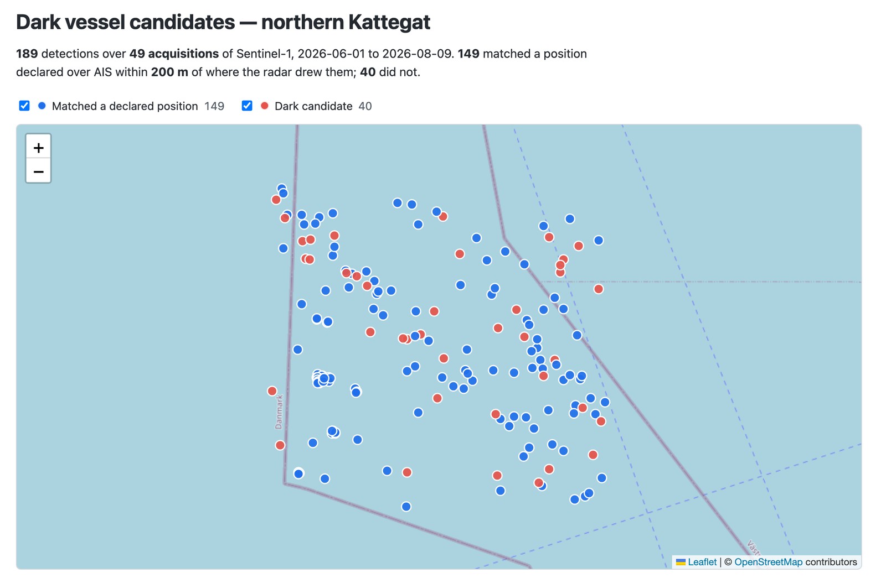
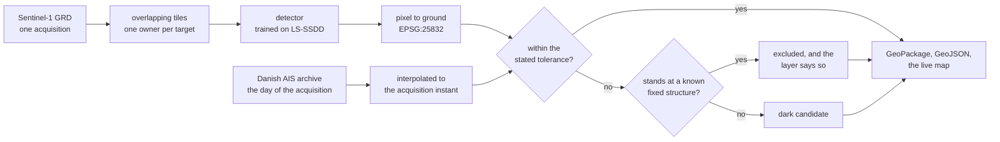

# Dark Vessel Detection

**Detecting undeclared vessels by fusing Sentinel-1 SAR imagery with AIS records over Danish waters.**

[](https://github.com/esamoun/dark-vessel-detection/actions/workflows/ci.yml)

[](https://esamoun.github.io/dark-vessel-detection/)

**[See the detections on a live map](https://esamoun.github.io/dark-vessel-detection/).** The chain
ran over 50 Sentinel-1 acquisitions of the northern Kattegat, 49 of which carried at least one
detection: 189 detections in all, matched against AIS, 40 of them undeclared. Static page, no
backend.

---

## The problem

Ships are legally required to broadcast their position over AIS (Automatic Identification
System). Some do not: the transponder is switched off, spoofed, or simply absent. These are
*dark vessels*, and they matter: illegal fishing, sanctions evasion, unreported transfers at sea.

Radar sees them anyway. Sentinel-1 acquires C-band SAR regardless of cloud or darkness, and a
metal hull on water is a strong scatterer against a near-black background. Detect every vessel in
the radar scene, match those detections against what AIS declared at the exact moment of
acquisition, and whatever is left over is a vessel that did not announce itself.

## Approach



The pipeline is built in four levels, each one shippable on its own.

| Level | What it does | Status |
| --- | --- | --- |
| **1. Detector** | Supervised CNN detector trained on labelled SAR scenes; honest precision/recall and failure analysis | trained, then measured a rung at a time: R1 gives 0.95 precision at 0.73 recall over a held-out split of 3000 sub-images, and the four changes that did not clear the noise are written up rather than removed |
| **2. Full-scene chain** | Inference over an entire Sentinel-1 scene: overlapping tiles, cross-tile deduplication, georeferenced GeoPackage output | runs on a real scene with the trained detector in it, since 2026-08-16 |
| **3. AIS fusion** | AIS positions interpolated to acquisition time, spatio-temporal matching, unmatched detections flagged as dark | **complete.** Runs on real Danish archives over a measured study area, with the azimuth shift of a moving ship compensated before matching. Offshore structures are excluded from the dark count without a single label: 65 fixed positions found by recurrence across 47 acquisitions, each verified against published coordinates to 5.1 m |
| **4. Spatial analysis** | Where dark vessels concentrate: distance to shore, bathymetry, EEZ boundaries, fishing effort | **complete.** 189 detections over 50 acquisitions, 40 of them undeclared: 21.2%, and [13.6%, 29.4%] once the interval is resampled over acquisitions rather than over detections. Of the four contextual variables one separates and three do not, [below](#what-the-archive-shows) |

The chain that carries these was built first, deliberately, with a deterministic stand-in where
the detector would go; the stand-in is still there, behind the same parameter, and is what the
tests and the synthetic run use. What runs today: scene in, detector injected at the pipeline
boundary, the scene cut into overlapping tiles and the targets they see reconciled into one list,
pixel coordinates converted to ground coordinates, each declared vessel interpolated along its
track to the moment of acquisition and the detections matched against those positions within a
stated tolerance, GeoPackage out. Both ends of that are real now: a Sentinel-1 acquisition fetched
clipped from Earth Engine, and a day of the Danish AIS archive streamed, filtered and cleaned
with every removal counted, and the detector between them is the trained one. Detections standing
at a known fixed structure are taken out of the dark count and say so in the layer. What keeps a
dark result from being a finding about the sea is now one thing rather than three: it has run over
one study area.

A vessel moves between its last AIS report and the instant the radar images it: at 12 knots, some
370 m a minute, which is more than the match tolerance. Comparing a detection against a report
taken as it stands therefore manufactures dark vessels that were never there, and that is the
most likely way for this project to produce a confidently wrong answer. Each vessel is placed at
the acquisition timestamp before anything is compared. Where its track gives nothing to
interpolate between, because it ends before the radar looks or the vessel reported once, the nearest
report is used and the row says so, in `position_basis`. Nothing is extrapolated past a track:
prolonging one from a course and speed derived from earlier points would manufacture a position
where no measurement exists.

A vessel on a tile boundary is seen by two tiles and must be reported once. That is done by
ownership rather than by merging detections after the fact: each tile answers for one slice of
the scene and stays quiet about the rest, so the count is right by construction and there is no
merge radius to tune. The reasoning, and the one condition it places on the config, are in
[`docs/decisions.md`](docs/decisions.md).

Two deep learning components sit inside this:

- **Supervised object detection** on SAR. The hard parts are genuinely hard: vessels are a few
  pixels wide at 10 m resolution, the background/foreground imbalance is extreme, pretrained RGB
  backbones have to be adapted to single-channel radar amplitude, and only geometry-preserving
  augmentations are physically valid on SAR.
- **Self-supervised contrastive embeddings** over detection crops. Offshore wind turbines are
  bright point scatterers that look a great deal like ships, and an unsupervised embedding space
  does separate them into distinct clusters without any additional labelling: measurably, at
  0.768 against 0.5 at chance. It turned out not to separate them *well enough to delete a
  detection on*, so the exclusion is built on where a thing stands over ten weeks rather than on
  what it looks like, and the measurement that settled it is
  [below](CHANGELOG.md#telling-a-turbine-from-a-ship-2026-08-27). The embedding earns its place as a
  similarity-search index over the detection archive and as the evidence that the clusters exist.


*The detector, measured rather than asserted. Six points, because six thresholds are what the run
scored. The chain runs at the last of them, 0.90: 0.95 precision at 0.73 recall, giving up under
two points of F1 against the peak at 0.75 to buy 246 fewer false alarms. What the 651 misses are
made of, and the ten conditions this has never been tested under, are in
[`docs/evaluation.md`](docs/evaluation.md).*


*The embedding, asked for the nearest neighbours of six detections across ten weeks of
acquisitions. It returns the same object 71% of the time against 0.02% at chance. It does not
separate turbines from ships well enough to delete a detection on, which is why the exclusion is
built on recurrence instead.*

Everything else (AIS interpolation, spatio-temporal matching, contextual analysis) is
geospatial data engineering, not deep learning, and is described as such.

## What the archive shows

The chain ran across all 50 acquisitions of the study area and 189 detections accumulated into one
layer, 40 of them undeclared: 21.2%, and [13.6%, 29.4%] once the interval is resampled over
acquisitions rather than over detections. Four contextual variables were sampled at each
detection. One of them separates; three do not, and are reported as not separating rather than
left out.

| Variable | What the archive shows |
| --- | --- |
| **Distance to shore** | The one that separates. The 770 m band carrying the declared lane holds 61 detections per kilometre against 8.8 in the widest band, and is 2.1% dark [0.0%, 6.5%] where the archive is 21.2% |
| **Water depth** | Every band's interval overlaps every other. Nothing is claimed |
| **Recorded fishing effort** | Every band's interval overlaps every other. Nothing is claimed |
| **EEZ** | 158 detections in Danish water, 31 in Swedish: 19.6% [11.5%, 28.1%] dark against 29.0% [10.0%, 48.6%]. The intervals overlap and nothing is claimed from the difference |


*The bands are equal-count, not equal-width, which is what makes the lane visible: 47 detections
inside 770 m of it against 48 spread over the 5.5 km band beside it. Every number here comes out
of [`docs/runs/analysis-archive.json`](docs/runs/analysis-archive.json), written by `darkvessel
analyse`, so it is re-derivable by anyone holding the GeoPackage.*

## What this does not support

It has run over one study area. Nothing here is evidence about any other water, and no claim of
transfer is made. The detector's precision and recall are measured on a held-out split of LS-SSDD
rather than on the Kattegat, so the numbers above describe a chain whose detector was never scored
on the water it ran over. An unmatched detection is published as a **candidate** at a stated
tolerance, not as an established dark vessel.

[`docs/evaluation.md`](docs/evaluation.md) is the honest account of where the detector breaks and
the ten conditions it has never been asked to work under.


## Data

| Source | Use | Access |
| --- | --- | --- |
| Sentinel-1 GRD | SAR imagery | Copernicus Data Space / Earth Engine `COPERNICUS/S1_GRD` |
| Danish Maritime Authority AIS | Declared vessel positions | open daily archives, `aisdata.ais.dk` |
| [LS-SSDD-v1.0](https://doi.org/10.3390/rs12182997) | Detector training | 15 large Sentinel-1 scenes, VV, cut into 9000 labelled sub-images |
| Earth Engine catalogue | Bathymetry, coastline, fishing effort | Google Earth Engine |
| Marine Regions (VLIZ) | EEZ boundaries | Maritime Boundaries Geodatabase v12, CC-BY, fetched per run and not redistributed |

Study area: **Danish waters**, chosen for dense and varied traffic, excellent Sentinel-1 revisit
as a Copernicus priority zone, and freely available raw AIS.

Within them, a 17 km box in the northern Kattegat on the approach to Skagen, and the box is
measured rather than picked. `darkvessel survey` streams a day of Danish AIS and ranks every
rectangle of that size in the Kattegat by how many vessels of 100 m or more, under way, stand
inside it in a given half hour. This one holds five or six at an arbitrary instant and is never
empty. The first study area was chosen off a map for its wind farm, which put it in quiet water
where the largest vessel ever imaged was 15 m; the whole argument, and what the move gives up,
is in [`docs/decisions.md`](docs/decisions.md).

## Repository layout

```
src/darkvessel/
  pipeline.py the single seam: scene + AIS + injected detector -> classified detections
  cli.py      the one command; builds the detector and hands it to the pipeline
  data/       study area and the survey that chose it, Sentinel-1 export, Danish AIS archives
              and ingestion, published offshore-structure coordinates and EEZ boundaries,
              tiling, fixtures
  detect/     detector contract, labelled dataset and augmentations, model, training,
              checkpoints and resume, precision/recall, inference, pixel->geo
  embed/      detection crops, contrastive views and training, the archive they
              accumulate in, nearest-neighbour retrieval and its checks, finding the
              fixed structures the archive holds and verifying them
  fusion/     AIS interpolation to acquisition time, spatio-temporal matching, the
              register of fixed structures a run will not call dark vessels
  context/    contextual variables at each detection: distance to shore, water depth and
              fishing effort sampled from the catalogue, EEZ membership joined locally
  analysis/   the distribution of dark candidates against each of those variables, with
              intervals resampled over acquisitions rather than over detections
  viz/        the GeoJSON export and the static page it is drawn on
configs/      pipeline configuration
data/reference/  published structure coordinates, and the register built from the archive
notebooks/    exploration and Kaggle/Colab training entry points
tests/        unit tests for the geometry-critical paths
docs/         decision log, failure log, the design written before issues #10 and #11 were
              built, the training runbook, the rest of the commands, and the published page
```

## Related work

This is a known and actively worked problem, not an invented one. The task is the subject of a
public detection challenge on Sentinel-1 with AIS-derived labels, of an established research
literature on SAR ship detection, and of operational commercial services. What was read, what
was reused and what was rejected is in [`docs/related-work.md`](docs/related-work.md).

What is specific here is the instance rather than the task: this study area, an AIS ingestion and
interpolation pipeline built from raw national archives, the contextual analysis layer, and
embedding-based disambiguation of vessels from fixed offshore structures.

## Engineering notes

Constraints are stated rather than hidden. Training runs on free-tier cloud GPUs with short,
resumable sessions and checkpointing from the first epoch. The training subset is deliberately
scoped and documented. Where results are modest, they are reported as modest. A detector that
usefully ranks candidates for inspection is a different and more honest claim than a detector
that maps them.

- [`docs/evaluation.md`](docs/evaluation.md): how well the detector works, and where it breaks
- [`docs/decisions.md`](docs/decisions.md): why each choice was made
- [`docs/failures.md`](docs/failures.md): what was tried and did not work

## How this was built

I used Claude Code throughout, as an assistant. It wrote a share of the code and much of the
prose, under review.

What it did not do is decide. The study area, the choice to train a detector rather than
threshold the imagery, the ablation ladder and the decision to reject R5, the tolerance the
matching runs at, and the decision to publish unmatched detections as candidates rather than as
findings, are mine. [`docs/decisions.md`](docs/decisions.md) is the record of that reasoning, and
it is the honest place to judge whether I understand what is here.

## Setup

```bash
conda env create -f environment.yml
conda activate darkvessel
pip install -e ".[dev]"
```

Training and Earth Engine dependencies are extras, `".[detector]"` and `".[gee]"`, and are not
needed to run the pipeline.

## Running the chain

No credentials, no downloads, no weights:

```bash
darkvessel synthesise --out data/synthetic
darkvessel run --config configs/pipeline.yaml
```

```
5 detections in EPSG:25832 -> outputs/detections.gpkg
  4 matched, 1 dark at a tolerance of 200 m, against 5 declared positions
  of those matches, 1 on a position interpolated to the acquisition and 3 on a report taken as it stands
  no detection stood at a registered fixed structure
```

One of those five is a vessel under way, 900 m west of its target three minutes before the
acquisition and 600 m east of it two minutes after. Neither report stands within the tolerance;
the interpolated position lands on the target. Matched against a report as it stands, it comes
back as a dark vessel that was never there.

A real Sentinel-1 scene, the embedding level, the archive of fifty acquisitions and the map are
each a handful of commands more, in [`docs/running.md`](docs/running.md).

## Training the detector

This is the one part of the project that needs a GPU, and it does not run here: the development
machine is an 8 GB M1 laptop, so training happens on a Kaggle free tier where the labelled data
is already attached and never touches the local disk. What is in the repository is the run:
`darkvessel train --config configs/train.yaml`, driven by a config file like every other stage,
with [`notebooks/kaggle-train.ipynb`](notebooks/kaggle-train.ipynb) as a four-cell wrapper that
clones, installs and calls it.

The run-by-run record of the training runs, the numbers each one produced and the changes that did
not clear the noise is in [CHANGELOG.md](CHANGELOG.md).

## Licence

MIT, see [LICENSE](LICENSE).
