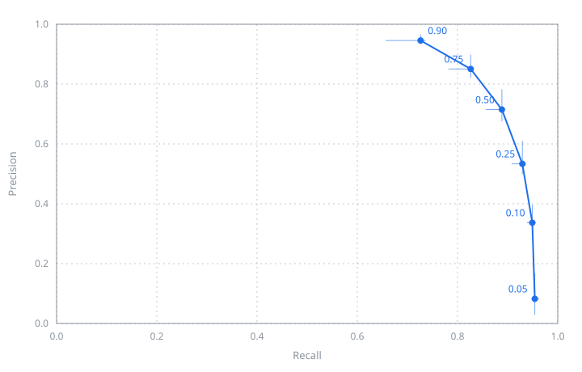

# Evaluation — what the detector finds, what it does not, and what has never been asked of it

**2026-08-26. R1, epoch 12** — the configuration the ladder of issue #11 kept, and the weights
`configs/kattegat-lane.yaml` actually loads. Scored over the whole of LS-SSDD's held-out split:
scenes 11 to 15, 3000 sub-images, 2378 ships, empty tiles included.

**Which of the two executions.** R1 was run twice: once on 2026-08-23, which is the run the
ladder judged, and once on 2026-08-26, after the first session's working directory was lost with
its checkpoint still in it. This report describes the **second**, because that is the one whose
weights the chain loads, and a report of its sibling would be a report of a detector nobody runs.
What the two agree on is measured in `docs/decisions.md`, 2026-08-26: same verdict on all five
rungs, and a final statistic 0.0027 apart against a noise band of 0.010 to 0.016.

Everything below is derived from `docs/runs/r1-cosine-rerun.json`, which is committed, by
`darkvessel evaluate --metrics docs/runs/r1-cosine-rerun.json`. Nothing here needs a GPU, a
network or a checkpoint to check, and the last section says plainly which questions that leaves
unanswerable.

---

## What is being counted

Three decisions decide what a precision on this page means, and all three make it a more generous
number than an object-detection benchmark would report. They are stated first for that reason.

**A detection is credited by distance, not by overlap.** A detection lands on a ship if its centre
falls within **200 m** of the ship's centre — the same tolerance the AIS fusion downstream applies
to a declared position, read into pixels through the 10 m resolution. Overlap is the wrong
instrument here: a 60 m vessel is six pixels, so a box two pixels out already fails at half IoU,
and the score would be measuring a box no stage of this chain ever uses. The reasoning is in
`metrics.py`; the consequence is that these numbers are not comparable to a published mAP.

**One ship can be found once.** Detections claim ships in order of confidence and a claimed ship
is gone, so a detector that returns one hull four times is credited with one hit and charged three
false alarms — which is what those four would be to anyone sent out to look at them.

**The split is drawn by scene.** LS-SSDD's own published split, scenes 01–10 against 11–15, so
two cuts of one acquisition never straddle it. The training side was cut down to 2246 tiles to fit a
free tier; the held-out side is scored entire, empty tiles included, because empty tiles are
exactly where a false positive happens.

## The curve

| Score threshold | Precision | Recall | F1 | Found | False | Missed |
| --- | --- | --- | --- | --- | --- | --- |
| 0.05 | 0.082 (0.029–0.168) | 0.954 (0.952–0.963) | 0.152 | 2269 | 25299 | 109 |
| 0.10 | 0.337 (0.313–0.397) | 0.949 (0.938–0.956) | 0.497 | 2257 | 4447 | 121 |
| 0.25 | 0.533 (0.499–0.611) | 0.929 (0.908–0.937) | 0.678 | 2210 | 1933 | 168 |
| 0.50 | 0.715 (0.675–0.782) | 0.889 (0.856–0.891) | 0.792 | 2113 | 843 | 265 |
| 0.75 | 0.851 (0.821–0.899) | 0.826 (0.782–0.831) | **0.838** | 1965 | 345 | 413 |
| **0.90** | **0.946** (0.937–0.966) | **0.726** (0.656–0.736) | 0.822 | 1727 | 99 | 651 |

Six points, because six thresholds are what the run scored. It is a coarse curve and it is the
whole of one: nothing between 0.75 and 0.90 has been measured, and the chain operates in exactly
that gap's upper end.

**The interval beside each figure is where it went over the run's last four epochs** — epochs that
differ from one another by nothing except where the run was stopped. It is the real range and not
a symmetric error bar: the final epoch usually sits at one end of it. At the threshold the chain
runs, recall is 0.726 and the last four epochs covered 0.656 to 0.736 — 0.656 at epoch 9, 0.736
at epoch 11, 0.726 at the epoch that was kept. The same config, the same seed and the same data
report a recall eight points apart depending on which epoch the session happened to end on.

That band is the single most important number on this page. The run of 2026-08-14 moved precision
at a fixed threshold from 0.28 to 0.80 between two adjacent epochs while its training loss sat
still;
cosine decay, the one change the ladder kept, cut that wander from 0.026 to 0.010 measured on the
best-F1 statistic, and did not remove it. **Nothing here is stable to three decimal places, and no
figure on this page should be quoted to three.**

## Where the chain sits, and what it pays

`configs/kattegat-lane.yaml` runs at **0.90**, which is not where F1 is best. F1 peaks at 0.75, at
0.838; the chain gives up 0.016 of it to buy precision from 0.851 to 0.946 — 246 fewer false
alarms for 238 fewer ships found. That is a deliberate asymmetry and the reason is downstream
rather than statistical: every detection this chain fails to match against AIS is published as a
dark vessel, which is an accusation someone may be sent out on. A miss costs a ship nobody looked
at. A false alarm costs an inspection and a claim about a named vessel. The reasoning, and the
numbers the choice was made on, are in `docs/decisions.md` under 2026-08-16 and 2026-08-25.

The cost of that choice is stated here rather than left implicit: **at 0.90 the detector misses
27.4% of the ships in the split**, and the operating point is also the least stable one on the
curve: across the last four epochs precision moved by 0.029 and recall by 0.080.

What it buys on the scene rather than on the split is sharper than the table suggests. Over the
Kattegat frame, at this same 0.90, the weights of 2026-08-14 return **four** of the six declared
hulls — they score the 274 m vessel at 0.850 and the 24 m one at 0.862, both under the bar. These
weights return all six, the lowest at 0.927. Same threshold, same scene, two more ships.

## What the misses are made of

The 651 ships missed at 0.90 are not 651 ships the detector failed to see.

At 0.05 the same weights over the same split miss **109**. Every one of the other **542** produced
a detection within 200 m of the ship and was thrown away by the score threshold rather than by the
detector. Put the other way: **the detector's proposals cover 95.4% of the ships in the split, and
the reported recall is 72.6%. Twenty-three points of recall are lost to confidence, not to
detection.**

Two honest deductions from that number before anything is built on it.

- Some of those 542 are luck. At 0.05 the detector raises 25299 false alarms over 3000 tiles —
  8.4 per tile, 0.132 per km², against a tolerance disc of 0.126 km². Of order **eleven** of the
  651 would have a spurious detection land within tolerance by chance alone. Eleven, not 542.
- "The threshold throws them away" is not the same as "lowering the threshold would recover them".
  The curve says what lowering it costs: 0.75 buys 238 of those ships back for 246 extra false
  alarms, and 0.05 buys 542 back for 25200.

What this points at is **score calibration** rather than detection capacity, and it is the second
independent line of evidence pointing at the region
[issue #24](https://github.com/esamoun/dark-vessel-detection/issues/24) describes. The first was
the anchor census.

## Failure modes, by cause

Each one names what it is evidenced by, because two of these are measured over the held-out split
and three are single observations on one scene.

**1. Ships are matched by a rescue rule rather than by fitting anchors.** Over the 1123
ship-bearing training tiles and their 3637 ships, ninety percent of ships never reach the RPN's
0.7 foreground IoU threshold against *any* stock anchor. They become positives only because
`allow_low_quality_matches` guarantees every box its best anchor, and when a 16 px ship sits
inside a 32 px anchor the overlap is `256/1024 = 0.25` for every anchor containing it,
identically, so they tie at the maximum and the rescue rule forces all of them positive at once —
one tile produced 3098 that way. *Evidence: the census of 2026-08-19, `docs/decisions.md`.* This
is the standing explanation for the weak, badly separated confidences the section above measures,
and it is untested: two rungs failed in the region it describes (R2's anchor geometry, −0.048;
R4's sampler batch, −0.009) and neither changed the threshold itself. That is issue #24.

**2. Confidence wanders between epochs that are otherwise identical.** Recall at 0.90 covered
0.656–0.736 over the last four epochs; precision at 0.25 covered 0.499–0.611. *Evidence: the
per-epoch journal, `docs/runs/r1-cosine-rerun.json`.* The mechanism recorded on 2026-08-14 is that the
model reaches the neighbourhood of a minimum in about three epochs and then moves its score
calibration rather than its detections; the loss curve says nothing about it, and it was found
only because the held-out split is scored every epoch.

**3. One hull reported many times.** The bright-pixel stand-in reported a 274 m vessel as **eight
detections** — the cross of sidelobes around a large ship is bright enough to threshold as
separate targets — and 16 detections over the Kattegat scene resolved to 6 objects. The trained
detector reported the same six hulls exactly six times. *Evidence: the scene checked by eye on
2026-08-14 and the swap of 2026-08-16, both in the README.* Under the counting rule above, every
duplicate is a false alarm, so this failure mode is already priced into the false-alarm column;
what the scene shows is that the trained detector does not have it.

**4. A moving ship is not where it declared itself.** Four of the six declared vessels in the
Kattegat scene were imaged **341–632 m** from their AIS positions, almost purely north–south,
because a target's along-track velocity displaces it in azimuth. Before the correction the chain
called four declared, transponder-on vessels dark. *Evidence: `docs/failures.md`, 2026-08-16.*
Fixed by moving the declaration to where the radar would have drawn it before matching: 2 matched
became 5. This is a fusion failure rather than a detector failure, and it is in this report
because it is the largest single source of false dark vessels this project has found.

**5. Low-confidence noise, at a scale the statistic does not see.** 25299 false alarms at 0.05
against 99 at 0.90. Both rejected RPN rungs cut it — R2 to 9883, R4 to 14887 — and neither moved
the statistic, which is decided at 0.75. *Evidence: `docs/failures.md`, 2026-08-23 and 2026-08-25.*
It matters here only as a description of the proposal distribution: the detector is generous and
its scores, not its proposals, are what separate.

## Conditions under which this has never been tested

The list is long, and its length is the point.

- **One acquisition.** Every scene-level number in this project comes from a single Sentinel-1
  IW GRD frame over the northern Kattegat, on one date, in one sea state. There is no second scene,
  no second season and no repeat pass.
- **VV only, at both ends.** LS-SSDD is VV throughout and the Kattegat export is VV because Earth
  Engine's 48 MiB limit forced a choice between area and polarisation. Dual-polarisation is
  untested because there is no data for it — `docs/failures.md`, 2026-08-17.
- **No land in the frame, ever.** The study area is open water by construction. Nothing in this
  chain masks land, and no coastline has been put in front of it.
- **Fixed structures are excluded only where an archive has seen them.** Offshore turbines are
  bright point scatterers that a ship detector returns happily, and since 2026-08-27 the chain
  will not call one a dark vessel: `data/reference/fixed-structures.csv` holds 65 positions the
  Anholt archive carried a detection at in 20+ acquisitions, every one verified against published
  coordinates to 5.1 m at the median. The limit is what builds that file. Only an archive can —
  one acquisition cannot tell a mast from a ship that happens to be there — so a structure in
  water this project has not watched for ten weeks is still reported as a dark candidate. The
  study area itself has none, published or found, which is why the exclusion changes nothing over
  the lane and everything over the farm.
- **Calm water only.** High wind roughens the sea surface and raises the clutter floor. No scene
  in a high sea state has been run, and the behaviour is not extrapolable from these numbers.
- **Sparse traffic only.** Six vessels in the frame. Nothing has been run over a port approach,
  an anchorage, or a convoy where hulls are within a tolerance disc of one another — and the
  counting rule, one ship claimed once in confidence order, is exactly the rule most likely to
  behave differently there.
- **A fixed incidence angle.** The azimuth correction assumes **38.5°**, the middle of an IW
  swath, because the product does not carry the angle. 34° gives four matches on this scene, 38.5°
  and 43° give five, 46° gives four again.
- **A stretch fitted on the scene it is reported on.** The window between calibrated decibels and
  the 8-bit amplitude the model was trained on could not be measured end to end; its floor is
  measured, its width was swept from 25 to 60 dB against this scene's own declared vessels, and
  40 dB was taken as the middle of what worked. That is one free parameter tuned on one scene, and
  it is written down as that.
- **Truthful AIS.** A vessel that spoofs its identity or position while transmitting is matched
  and reported as declared. This chain detects silence, not lies.
- **More than one execution of the shipped weights, on the scene.** R1 has now been run over the
  Kattegat frame — six detections, six hulls, five matched and one dark, the same six vessels the
  2026-08-14 detector found and every score higher. But the scene-level numbers in causes 3 and 4
  below were established with that older detector, and only the totals have been repeated under
  these weights. See `docs/decisions.md`, 2026-08-26.

## What this report cannot say, and what would let it

Every failure mode above is evidenced by a count, a mechanism or a named vessel. **None is
evidenced by a picture of a tile the detector got wrong**, and no analysis here relates a miss to a
property of the ship that was missed — its length, its heading, its distance to another ship, the
scene it came from.

That is not an oversight in the writing; it is what this machine can reach. R1's weights are here
now, but **LS-SSDD is not** — the split these numbers describe is 3000 sub-images on Kaggle. Without
it there is no tile to crop and no box to measure against, so the 651 misses cannot be broken down
by anything, and the weights being local does not help: what is missing is the data, not the model.

One session on a rented GPU closes it, and the shape of it is known:

1. Score the held-out split once with R1 at a fine grid of thresholds rather than six, so the
   curve between 0.75 and 0.90 — where the chain lives — stops being an interpolation.
2. For each held-out ship, record the score of the best detection within tolerance, and join that
   against the ship's box size and scene. The 542/109 split above becomes a distribution instead
   of two numbers.
3. Write out the crops: the worst false alarms at 0.90, and the misses at both ends of the size
   distribution.

Until that runs, this report stands as what the committed measurements support, and it is stated
here which of its criteria that leaves partly met.
